# 1. 安装

npm:

```
npm i d3
```

或 script 引入

```html
<script src="https://d3js.org/d3.v5.js"></script>
<!-- 或者使用 minified 版本 -->
<script src="https://d3js.org/d3.v5.min.js"></script>
```

# 2. Hello World

```html
<body>
  <p></p>
  <p></p>
  <script>
    const p = d3.select("body").selectAll("p")
    p.text("Hello World")
  </script>
</body>
```

引用 d3 后，可以使用 d3.selectXX （类似 JQuery）语法，获取到页面上的 p 标签，然后调用 `.text` 方法即可往 p 标签里面写入文字

# 3. 选择元素和绑定数据

## 3.1 选择元素

- d3.select()
- d3.selectAll()

```javascript
const body = d3.select("body") // 选择文档中的 body 元素
const svg = body.select("svg") // 选择 body 中的 svg 元素
const p = body.selectAll("p") // 选择 body 中的所有 p 元素
const p1 = body.select("p") // 选择 body 中第一个 p 元素
```

## 3.2 绑定数据

D3.js 能将数据绑定到 DOM 上，绑定后，未来可以很方便的通过这个数据来操作对应的元素。

- data() : 将一个数组绑定到选择集上，数组各项和选择集中各元素绑定，也就是一一对应的关系。
- datum() : 将一个数据绑定到所有选择集上。

相比较而言，data() 更常用

datum() 的使用

```html
<body>
  <p>dog</p>
  <p>cat</p>
  <p>pig</p>

  <script>
    const str = "is an animal"
    const p = d3.select("body").selectAll("p")

    p.datum(str).text((d, i) => `第${i}个元素:${d}`)
  </script>
</body>
```

datum 是将 str 分别绑到三个 p 元素上

data() 的使用

```html
<body>
  <p>dog</p>
  <p>cat</p>
  <p>pig</p>

  <script>
    const arr = ["so cute", "cute", "fat"]
    const p = d3.select("body").selectAll("p")

    p.data(arr).text((d, i) => `第${i}个动物:${d}`)
  </script>
</body>
```

data 其实就是遍历数组并分别绑到 p 元素上

# 4. 理解 Update、Enter、Exit

图表操作大部分情况下其实就是将数据源（数组）中的数据，一一对应的用图形（可以是文字，可以是矩形，可以是线等等）表现出来，因为数据源里的数据个数是可变的，那么在和图形一一对应时，必然会出现数据多图形元素少，或者数据少图形元素多的情况，在 D3.js 中分别是用 Update、Enter、Exit 来表现的

在使用 data() 时，如果数组数量与元素集的数量不匹配时，就会涉及 Enter、Exit。


## 4.1 Update 与 Enter 的使用

```html
<body>
  <p>dog</p>
  <p>cat</p>
  <p>pig</p>

  <script>
    const dataset = [3, 6, 9, 12, 15]
    const p = d3.select("body").selectAll("p")

    const update = p.data(dataset) // 绑定数据，并得到 update 部分
    const enter = update.enter() // 得到 enter 部分

    // 对 update 的处理
    update.text((d, i) => `update: ${d}, index: ${i}`)

    // 对 enter 的处理
    // 要先添加足够多的 p 标签
    const pEnter = enter.append("p")
    // 然后再添加文本
    pEnter.text((d, i) => `enter: ${d}, index: ${i}`)
  </script>
</body>
```

## 4.2 Update 与 Exit 的使用

```html
<body>
  <p>dog</p>
  <p>cat</p>
  <p>pig</p>
  <p>rat</p>

  <script>
    const dataset = [3, 6]
    const p = d3.select("body").selectAll("p")

    const update = p.data(dataset) // 绑定数据，并得到 update 部分
    // 对 update 的处理
    update.text((d, i) => `update: ${d}, index: ${i}`)

    const exit = update.exit() // 得到 exit 部分
    // 对 exit 的处理
    exit.text((d, i) => "exit")
  </script>
</body>
```

# 5. 选择、插入、删除元素

## 5.1 选择元素

### (1) 例子一

```html
<body>
  <p>dog</p>
  <p>cat</p>
  <p>pig</p>
  <p>rat</p>
</body>
```

选择第一个 p 元素并将字体颜色设置为红色：

```javascript
d3.select("body").select("p").style("color", "red")
```

选择全部 p 元素并将字体颜色设置为红色

```javascript
d3.select("body").selectAll("p").style("color", "red")
```

### (2) 例子二

```html
<body>
  <p>dog</p>
  <p class="myP2">cat</p>
  <p id="myP3">pig</p>
  <p>rat</p>
</body>
```

选择 class='myP2' 的元素并将字体颜色设置为红色

```javascript
d3.select("body").selectAll(".myP2").style("color", "red")
```

选择 id='myP3' 的元素并将字体颜色设置为红色

```javascript
d3.select("body").select("#myP3").style("color", "red")
```

### (3) 例子三

```html
<body>
  <p>dog</p>
  <p>cat</p>
  <p>pig</p>
  <p>rat</p>

  <script>
    const dataset = [3, 6, 9, 12]
    const p = d3
      .select("body")
      .selectAll("p")
      .data(dataset)
      .text(function (d, i) {
        if (i == 3) {
          // this 只能通过 function 正常获取，意味着 () => {} 不能在这里使用，后续会继续研究有没有解决这个问题的方案
          // 目前来看只能在需要使用本节点的地方使用 function() 定义函数
          d3.select(this).style("color", "red")
        }
        return d
      })
  </script>
</body>
```

## 5.2 插入元素

- append() : 在选择集尾部插入元素
- insert() : 在选择集前面插入元素

```javascript
d3.select("body").append("p").text("another animal") // 在最后添加一个新的 p 元素
d3.select("body").insert("p", "#myP3").text("insert an animal") // 在 id='myP3' 的元素前插入一个新的 p 元素
```

## 5.3 删除元素

```javascript
d3.select("body").select("#myP3").remove() // 选择 id='myP3' 的元素并删除
```

# 6. 做一个简单的图表

新的知识点：

- svg: 是用来绘制矢量图的画布（对应的 canvas 是 js 用来绘制位图的画布）
- rect: 是 D3.js 在 svg 中绘制**矩形**的元素
- g: 分组时使用

# 7. 比例尺的使用

D3.js 中的比例尺可以理解为是一种映射关系

常见的比例尺：

- 线性比例尺
- 序数比例尺

## 7.1 线性比例尺

```javascript
const dataset = [1.2, 2.3, 0.9, 1.5, 3.3]
const min = d3.min(dataset) // 得到最小值
const max = d3.max(dataset) // 得到最大值
const scaleLinear = d3.scaleLinear().domain([min, max]).range([0, 300]) // 0.9-3.3 对应 0-300
document.write("scaleLinear(1) 输出：" + scaleLinear(1)) // 12.4999999999996
d3.select("body").append("br")
document.write("scaleLinear(2) 输出：" + scaleLinear(2)) // 137.5
d3.select("body").append("br")
document.write("scaleLinear(3.3) 输出：" + scaleLinear(3.3)) // 300 因为domain中的3.3对应的就是range中的300
d3.select("body").append("br")
```

## 7.2 序数比例尺

```javascript
const dataset = [0, 1, 2, 3, 4]
const color = ["red", "blue", "yellow", "black", "green"]
const scaleOrdinal = d3.scaleOrdinal().domain(dataset).range(color) // domain 和 range 是离散，并一一对应的
document.write("scaleOrdinal(1) 输出：" + scaleOrdinal(1)) // 1: blue
d3.select("body").append("br")
document.write("scaleOrdinal(2) 输出：" + scaleOrdinal(2)) // 2: yellow
d3.select("body").append("br")
document.write("scaleOrdinal(4) 输出：" + scaleOrdinal(4)) // 4: green
d3.select("body").append("br")
```

之前 6 的图表例子中，如果数据源里面的数字非常大，绘制的矩形会撑出浏览器。使用线性比例尺后可以让矩形的宽度在一个合理的范围内。

# 8. 坐标轴

新的知识点：call()

```javascript
const xAxis = d3
  .axisBottom(scaleLinear) // 从 scaleLinear 比例尺创建出一个坐标轴, Bottom 表示刻度是在下面
  .ticks(7) // 设置刻度数目

g.call(xAxis) // call 可以将 g 传给 xAxis 执行
// 或者反过来也可以
xAxis(g)
```

# 9. 完整的柱状图

新的知识点：

- d3.scaleBand() : 根据长度等分区域
- d3.range() : 返回等差数列，如：d3.range(5) 返回 [0,1,2,3,4]

# 10. 让图表动起来

新的知识点：

- .attr(xxx).transition().attr(xxx) : transition() 表示过渡，即从前一个属性过滤到后一个属性
- .duration(2000) : 表示过渡时间持续 2 秒
- .delay(500) : 表示延迟 500 毫秒
- .ease(d3.easeElasticInOut) : 过渡方式

# 11. 交互式操作

新的知识点：

- on('eventName', function) : 监听事件
- d3.select(this) : 选择当前元素

常见的事件类型：

- click : 鼠标单击，相当于 mousedown 和 mouseup 的组合
- mouseover
- mouseout
- mousemove
- mousedown
- mouseup
- dblclick

# 12. 图形

D3.js 中一些常见的图形：

## 12.1 bubble 泡泡图

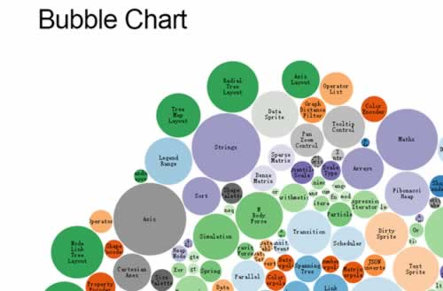

## 12.2 packing 打包图

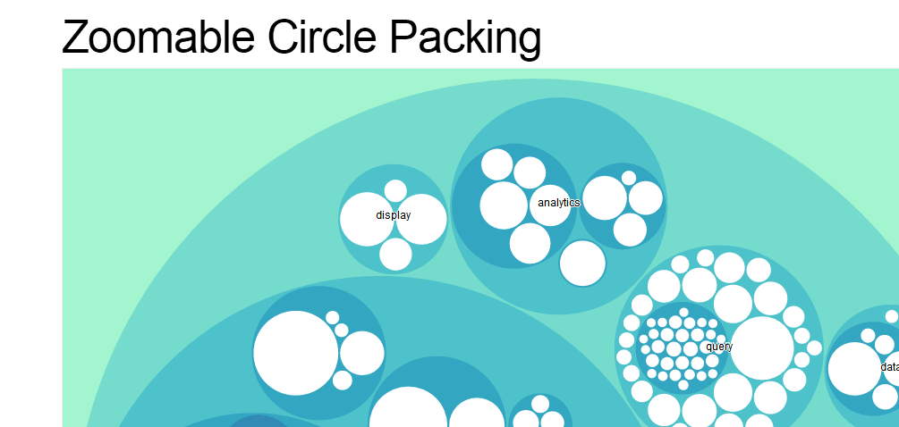

## 12.3 bundling 捆图


## 12.4 force 力导向图

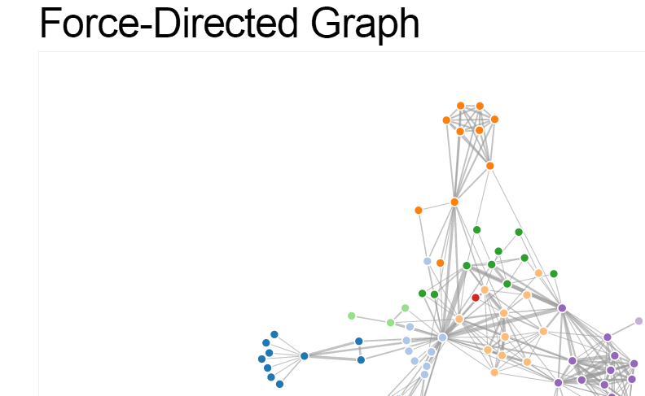

## 12.5 chord 弦图

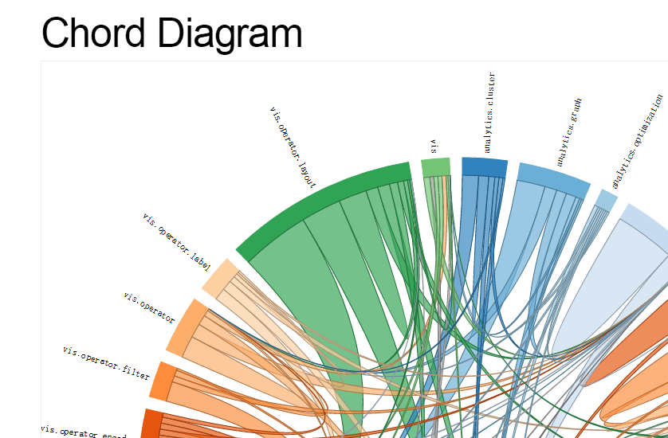

## 12.6 pie 饼状图

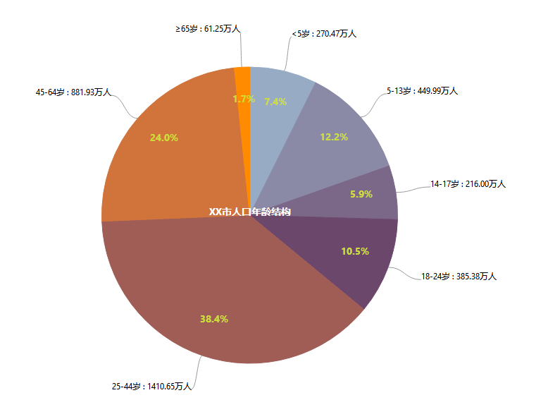

## 12.7 tree 树状图

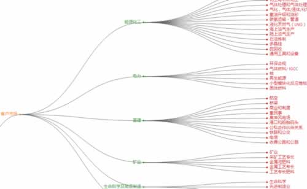

## 12.8 中国地图

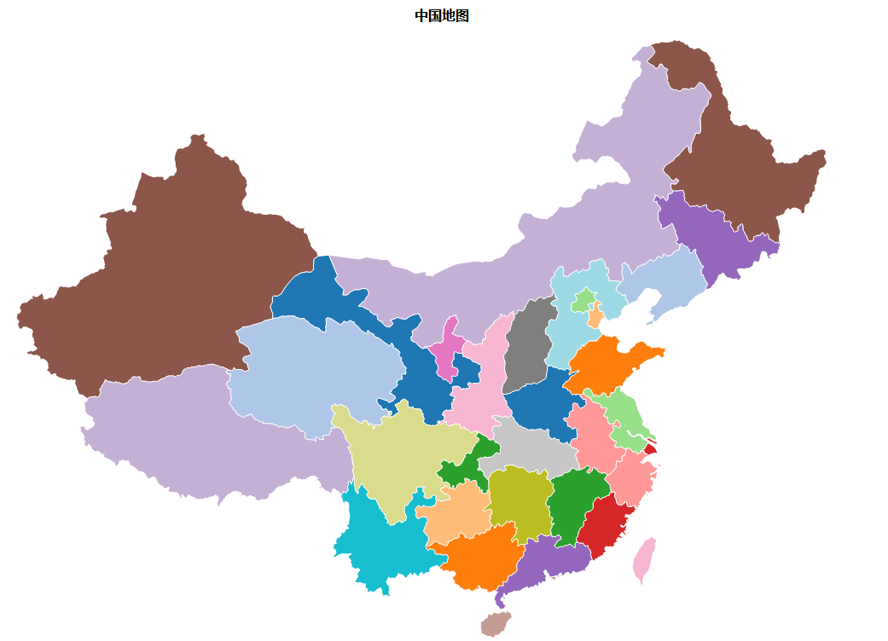

# 13. 饼状图

新的知识点：

- d3.arc() : 弧形生成器，用以绘制弧形
- d3.pie() : 饼状图生成器
- d3.arc().centroid() : 扇形区域的相对中心点
- d3.schemeCategory10 : 离散的色彩

# 14. 力导向图

新的知识点：

- d3.forceSimulation() : 新建一个力导向图
- d3.forceSimulation().force() : 添加或者移除一个力
- d3.forceSimulation().nodes() : 将输入的数组进行转换，添加上坐标等
- d3.forceLink.links() : 对输入的数组（边集）进行转换
- tick : 不断执行以用来更新节点和连线位置
- d3.drag() : 拖动

# 15. 树状图

新的知识点

- d3.hierarchy() : 层级布局，需要和 tree 生成器一起使用，来得到绘制树所需要的节点数据和边数据
- d3.hierarchy().sum() : 后序遍历
- d3.tree() : 创建一个树状图生成器
- d3.tree().size() : 定义树的大小
- d3.tree().separation() : 定义邻居节点的距离
- node.descendants() : 得到所有节点，已经是经过转换的数据
- node.links() : 得到所有的边，已经是经过转换的数据
- d3.linkHorizontal() : 创建一个贝塞尔曲线生成器，这个是水平的，还有垂直的 (d3.linkVertical())

# 16. 中国地图

[中国地图 JSON 数据源](http://datav.aliyun.com/tools/atlas)

# 各种图例：

## https://observablehq.com/@d3/gallery

## Dots - Scatterplot

[参考](https://observablehq.com/@d3/scatterplot)

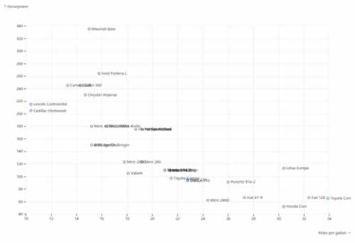

新的知识点：

- d3.scaleLinear().ticks() : 返回刻度列表，可以以这个列表作为数据继续操作
- circle : 圆形、点元素

## Dots - Scatterplot with Shapes

[参考](https://observablehq.com/@d3/scatterplot-with-shapes)

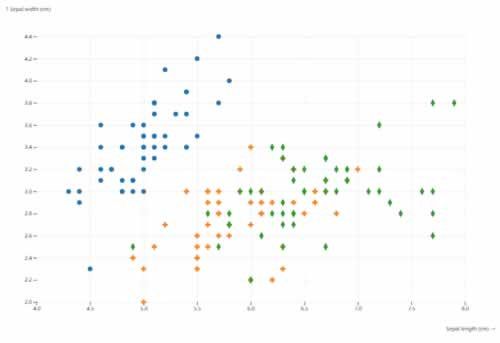

新的知识点：

- d3.symbols() : 获取 d3 默认提供的一批符号 shapes
- d3.symbol().type()() : 创建一个符号 shape

## Dots - Scatterplot Matrix

[参考](https://observablehq.com/@d3/scatterplot-matrix)

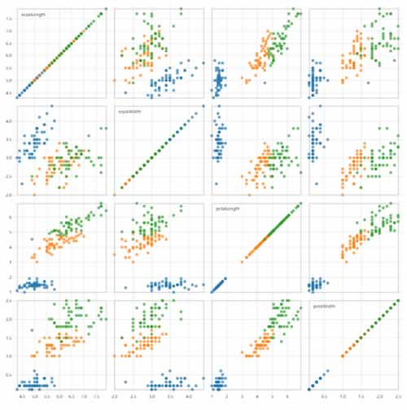

新的知识点：

- d3.cross() : 将二个数组的值交叉组成一个数组，如 [1,2],[3,4] 将组成 [1,3],[1,4],[2,3],[2,4]

## Lines - Line Chart

[参考](https://observablehq.com/@d3/line-chart)

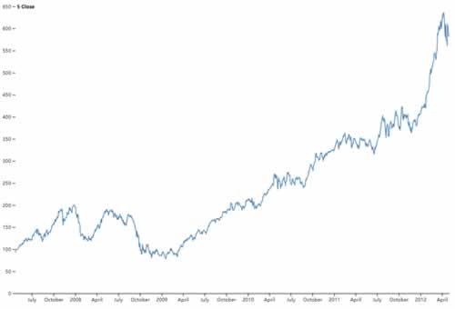

新的知识点：

- d3.scaleUtc() : 时间比例尺
- d3.extent() : 区间范围，比例给定一组日期数据，会返回这组数据的日期范围
- d3.scaleLinear().nice() : 标尺可以更有头有尾，即原来如果是25-618 的数据，使用 nice 后会给出 0-650 范围
- d3.axisBottom().ticks() : 刻度间隔
- d3.axisLeft().tickSizeOuter() : 标尺起点与终点的刻度大小

## Lines - Line with Missing Data

[参考](https://observablehq.com/@d3/line-with-missing-data)

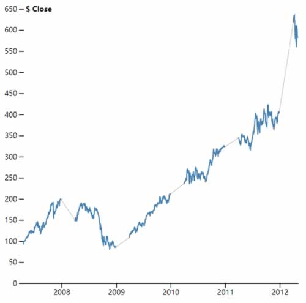

思路：过滤掉只有日期但没有值的数据，根据这组数据画灰线，没有值的地方会直接连线。然后画完整数据，有日期但没有值的地方将不绘制线段。

## Lines - Multi Line Chart

[参考](https://observablehq.com/@d3/multi-line-chart)

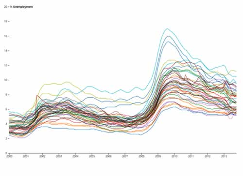

新的知识点：

- path.filter().raise() : 按 filter 将过滤后的线段提升到最上层，一般用于有多条线的图
- style('mix-blend-mode', 'multiply') : 重合区域的混合模式， multiply 将会让重合区域加深

## Lines - Change Line Chart

[参考](https://observablehq.com/@d3/change-line-chart)

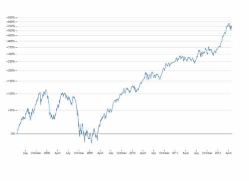

## Lines - Marey's Trains

[参考](https://observablehq.com/@mbostock/mareys-trains)

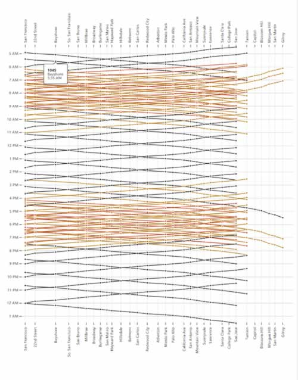

tooltip 的思路是给整个图表画一堆看不见的格子作为 mouseover, mouseout 的区域

## Lines - Candlestick Chart

[参考](https://observablehq.com/@d3/candlestick-chart)

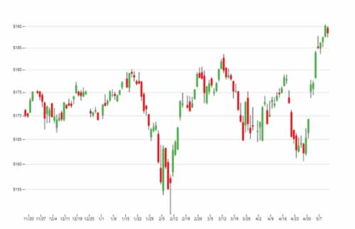

## Lines - Variable Color Line

[参考](https://observablehq.com/@d3/variable-color-line)


## Lines - Gradient Encoding

[参考](https://observablehq.com/@d3/gradient-encoding)

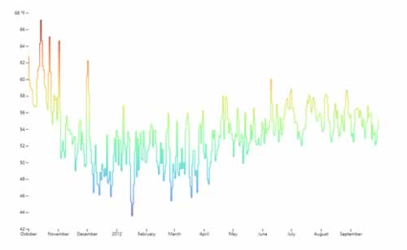

linearGradient 思路，设置一个整屏区域的渐变色，让 path 的 stroke  与 linearGradient 关联

新的知识点：

- linearGradient : 线性渐变元素
- stop : 线性渐变的关键颜色点
- stop-color : 关键点的颜色

## Bars - Bar Chart

[参考](https://observablehq.com/@d3/bar-chart)

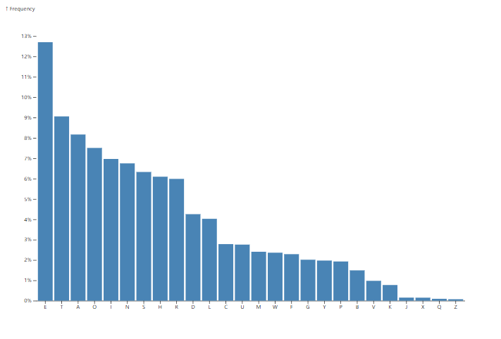

新的知识点：

- d3.scaleBand() : 波段比例尺
- bandwidth() : 获得波段平均分配的宽度

## Networks - Force-Directed Graph

[参考](https://observablehq.com/@d3/force-directed-graph)

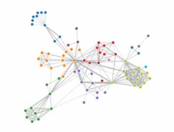

## Networks - Disjoint Force-Directed Graph

[参考](https://observablehq.com/@d3/disjoint-force-directed-graph)

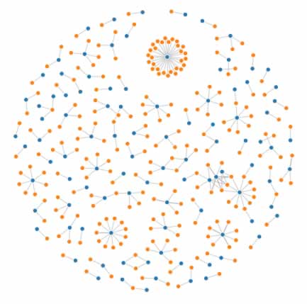

## Networks - Mobile Patent Suits

[参考](https://observablehq.com/@d3/mobile-patent-suits)

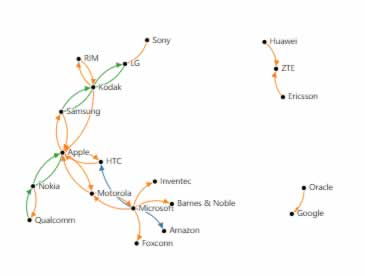

## Networks - Arc Diagram

[参考](https://observablehq.com/@d3/arc-diagram)

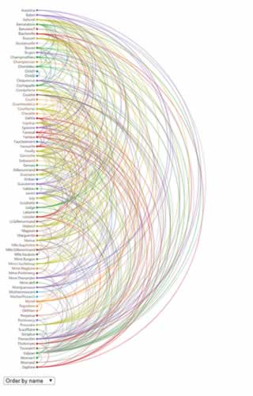

新的知识点：

- pointer-events : 对于空的元素，如果要让它响应鼠标事件，需要设置这个属于为 'all'
- classed : 可以对元素设置样式 class
- order() : 因为 raise() 而置顶过的元素，可以让整批元素调用 order() 重新排序

## Radial - Pie Chart

[参考](https://observablehq.com/@d3/pie-chart)

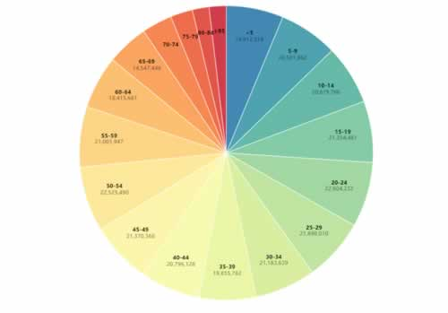

新的知识点：

- d3.arc() : 用 innerRadius 和 outerRadius 确定内半径和外半径，当 innerRadius(0) 时，表示饼图，其他数值为环形图

## Radial - Donut Chart

[参考](https://observablehq.com/@d3/donut-chart)

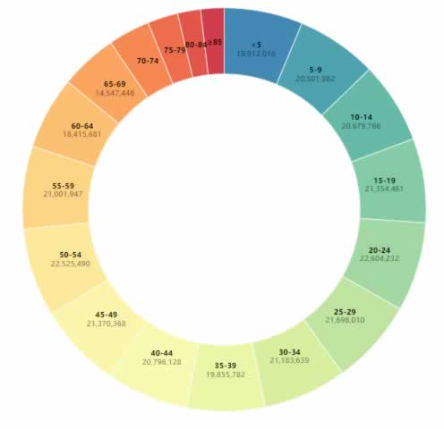

和 Pie Chart 的唯一区别就是 arc 的 innerRadius

## Radial - Radial Area Chart

[参考](https://observablehq.com/@d3/radial-area-chart)

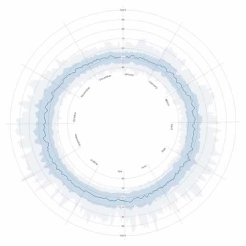

新的知识点：

- textPath : 指定 xlink:href #id 即可定位到指定 id 的元素

## Radial - Radial Stacked Bar Chart

[参考](https://observablehq.com/@d3/radial-stacked-bar-chart)

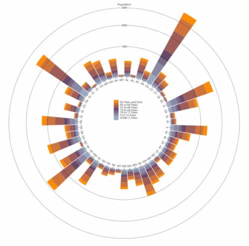

新的知识点：

- transform : rotate 和 translate 的先后顺序非常重要

## Radial - Radial Stacked Bar Chart 2

[参考](https://observablehq.com/@d3/radial-stacked-bar-chart-ii)

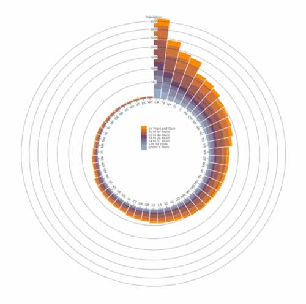

和上一个最大的改动就是数据从大到小排了个序

## Annotation - Inline Labels

[参考](https://observablehq.com/@d3/inline-labels)

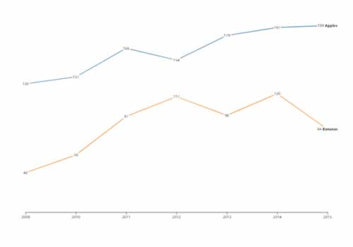

## Analysis - Moving Average

[参考](https://observablehq.com/@d3/moving-average)


## Hierarchies - Treemap

[参考](https://observablehq.com/@d3/treemap)

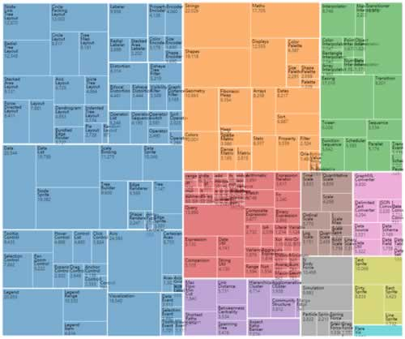

新的知识点：

- join() : 会自动让选择的元素集与数据源的个数相同。即自动完成了 enter 和 exit，并返回合并后的元素集。也可以传入若干个方法来自定义 enter, update, exit 的行为。如：`join(enter => enter.append(''), update => update, exit => exit.remove())`
- d3.format(",d") : 将数字 1000 格式化为 1,000
- d3.treemap() : 生成一个 treemap
- d3.treemap().tile(tile) : 块的布局模式
  - d3.treemapBinary : 常用的模式
  - d3.treemapSquarify : 常用的模式
  - d3.treemapDice : 竖切
  - d3.treemapSlice : 横切
  - d3.treemapSliceDice : 横竖切
- d3.hierarchy(data) : 根据 data 生成层级布局的数据，会有 parent, children, height, depth 等信息
- d3.hierarchy().sum(d => d.value) : 后序遍历，即从子节点开始往根节点遍历，一般用来统计每个父节点的权重值(value)，权重值是 sum 这个节点所有子节点指定的(value)
- treemap(hierarchy) : 将层级布局数据转换成 treemap 数据，会多出 x0,x1,y0,y1 四个属性，表示每个节点所占 tile 的大小
- treemap().leaves() : 获取所有叶子节点
- Node.ancestors() : 获取从节点到根节点的继承链，是一个数组

## Hierarchies - Cascaded Treemap

[参考](https://observablehq.com/@d3/cascaded-treemap)

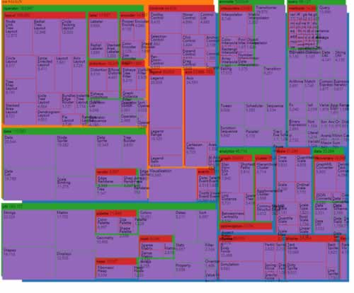

## Hierarchies - Circle Packing

[参考](https://observablehq.com/@d3/circle-packing)

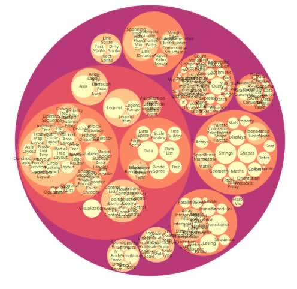

新的知识点：

- filter : 定义好一个 filter 元素并指定一个 id 后，要使用这个滤镜的元素只需要设置 filter 属性为 url(#id) 即可生效

## Hierarchies - Circle Packing (monochrome)

[参考](https://observablehq.com/@d3/circle-packing-monochrome)

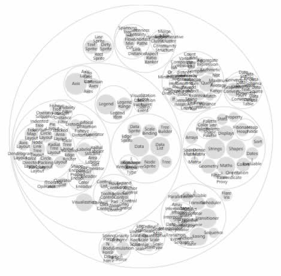

## Hierarchies - Indented Tree

[参考](https://observablehq.com/@d3/indented-tree)

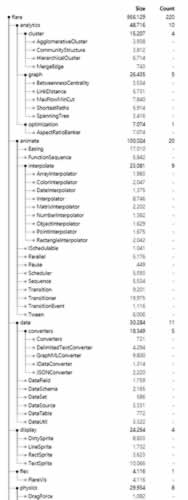

新的知识点：

- d3.hierarchy().copy() : 拷贝一份数据，用于做一些额外运算而不会影响源数据

## Animation - Animated Treemap

[参考](https://observablehq.com/@d3/animated-treemap)

新的知识点：

- Node.textContent : 可以直接访问到显示的文本，也可以直接设置修改显示的文本
- d3.interpolate(a, b) : 会返回一个计算 a 到 b 之前插值的方法 fn，通过调用这个方法 fn(t)，t: 0-1，返回 a 到 b 之前的值
- d3.interpolateRgb() : 返回二个颜色之前的插值函数
- transition.tween(name, fn) : 自定义 tween
- d3.range(x, y, step) : 生成一个从 x 到 y 步长为 step 的区间数组
- d3.csvParse() : csv 转换
- d3.tsvParse() : tsv 转换
- d3.nest() : 将数组中某些关联数据组成树状结构。如：`[{name:'张三', value: 100, type:1}, {name:'张三', value:50, type:2}] 可以转换为 [{key:'张三',values:[...包含所有name为张三的数据]}]`

## Animation - Connected Scatterplot

[参考](https://observablehq.com/@d3/connected-scatterplot)

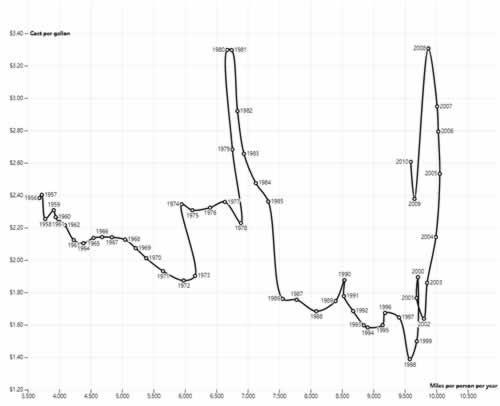

新的知识点：

d3.curve(d3.curveCatmullRom) : 画弧线