# 折线图 (Line)

## Basic Line Chart

[参考](https://echarts.apache.org/examples/zh/editor.html?c=line-simple)

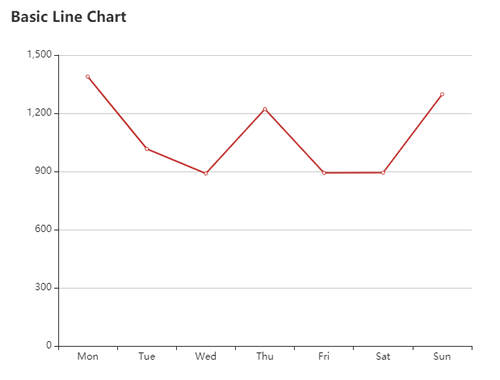

## Basic Area Chart

[参考](https://echarts.apache.org/examples/zh/editor.html?c=area-basic)

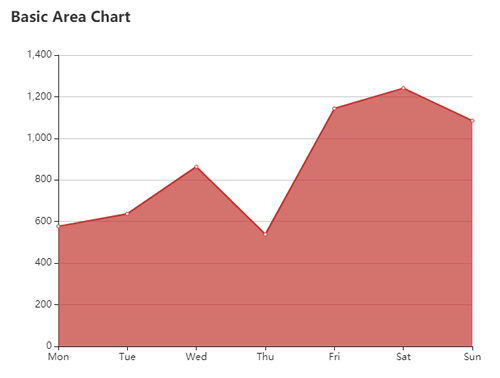

新的知识点：

- boundaryGap : 默认值 true, 坐标轴两端是否留白。
- areaStyle : area 样式，设置一个{}，即可以让 chart 表现为 area chart 。

## Smoothed Line Chart

[参考](https://echarts.apache.org/examples/zh/editor.html?c=line-smooth)

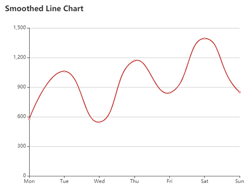

新的知识点：

- smooth : 设置为 true， 将变成平滑曲线。

## Stacked Area Chart

[参考](https://echarts.apache.org/examples/zh/editor.html?c=area-stack)

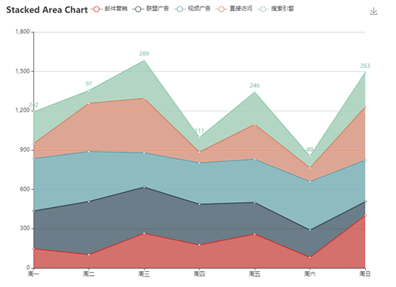

新的知识点：

- label : 可以设置将数据直接显示在点上，其中 position 属性可以设置 label 的位置 (top, bottom, left, right)
- tooltip : 设置提示框组件.
- legend : 图例组件.
- toolbox : saveAsImage 可增加一个保存为图片的按钮.
- stack : 数据堆叠.

## Stacked Line Chart

[参考](https://echarts.apache.org/examples/zh/editor.html?c=line-stack)

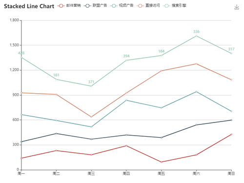

## Area Pieces

[参考](https://echarts.apache.org/examples/zh/editor.html?c=area-pieces)

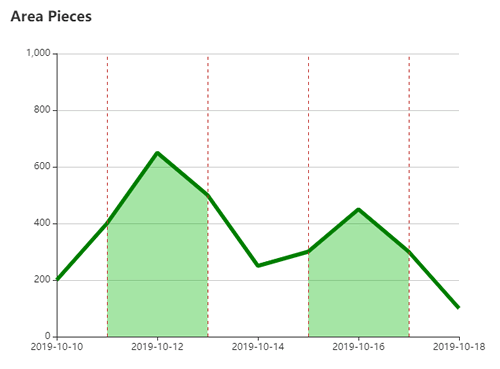

新的知识点：

- symbol : 设置为 'none' 将不显示线上的点.
- boundaryGap : [0,'30%'] 最大值将扩展30%.
- lineStyle : 自定义线的样式.
- markLine : 图表标线.
- visualMap : 数据映射.

## Rainfall

[参考](https://echarts.apache.org/examples/zh/editor.html?c=area-rainfall)

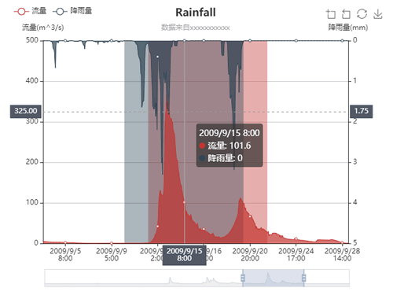

新的知识点：

- subtext : 可定义副标题.
- yAxisIndex : yAxis 可以设置多个（一个数组），用 yAxisIndex 可以指定数据参照的坐标轴数组的下标.
- inverse : 是否反向坐标轴.
- toolbox.feature.dataZoom : 提供区域缩放功能按钮，yAxisIndex: 'none' 锁定 y 坐标轴不缩放.
- toolbox.feature.restore : 恢复功能按钮，将区域缩放操作重置.
- dataZoom : 区域组件. 添加 inside 项，可以让图表本身拖动时改变 dataZoom 区域.

## Large Scale Area Chart

[参考](https://echarts.apache.org/examples/zh/editor.html?c=area-simple)

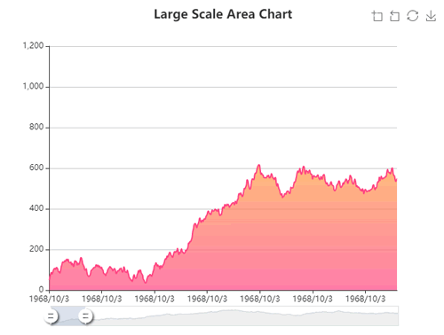

新的知识点：

- tooltip.position : 可以自定义 tooltip 出现的坐标.
- sampling : 当数据量大于像素点的是采样策略. 
- itemStyle : 定义样式.
- LinearGradient : 线性渐变.

## Confidence Band

[参考](https://echarts.apache.org/examples/zh/editor.html?c=confidence-band)

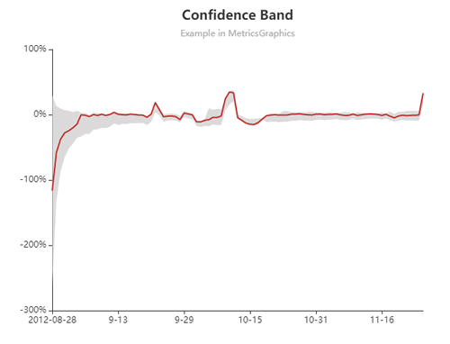

新的知识点：

- showLoading / hideLoading : chart 显示 / 隐藏 loading 组件.
- formatter : 可自定义格式化要显示的数据.

## Dynamic Data + Time Axis

[参考](https://echarts.apache.org/examples/zh/editor.html?c=dynamic-data2)

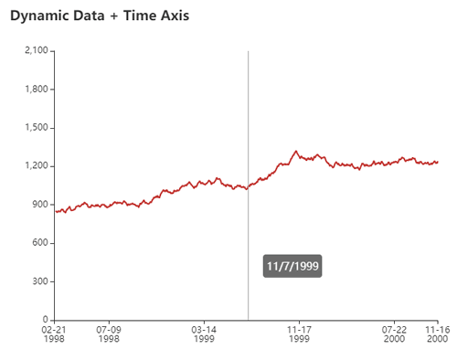

新的知识点：

- splitLine.show : 是否显示坐标轴的分隔线.
- setOption : 目测是增量设置 option 的.

## Rainfall and Water Flow

[参考](https://echarts.apache.org/examples/zh/editor.html?c=grid-multiple)

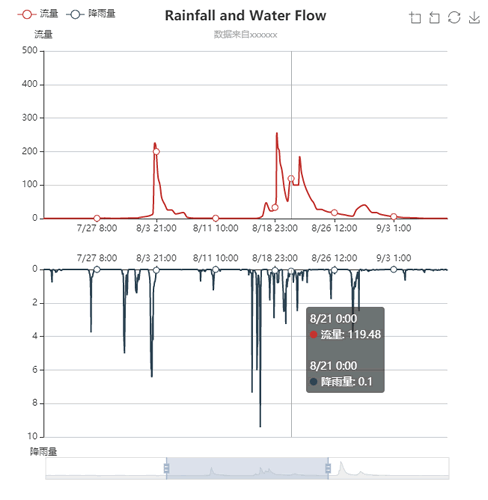

新的知识点：

- gridIndex : 一个图例中可以有多个坐标(xAxis, yAxis都需要设置 gridIndex)，但 grid 也必须设置为数组 , 否则会报错.
- xAxisIndex / yAxisIndex : series 中的数据通过设置这二个属性，可以将自己显示的位置切换到其他定义的坐标系下.

## Beijing AQI

[参考](https://echarts.apache.org/examples/zh/editor.html?c=line-aqi)

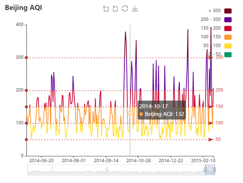

新的知识点：

- silent : 是否响应鼠标事件.
- visualMap.outOfRange : 未定义的映射数据的显示样式.

## Try Dragging these Points

[参考](https://echarts.apache.org/examples/zh/editor.html?c=line-draggable)

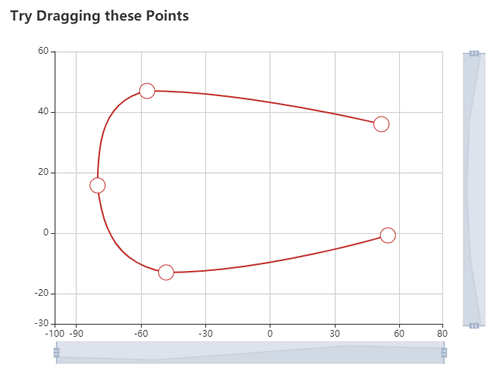

新的知识点：

- dispatchAction : 向 echart 发送事件, showTip; hideTip.

## Line Easing Visualizing

[参考](https://echarts.apache.org/examples/zh/editor.html?c=line-easing)

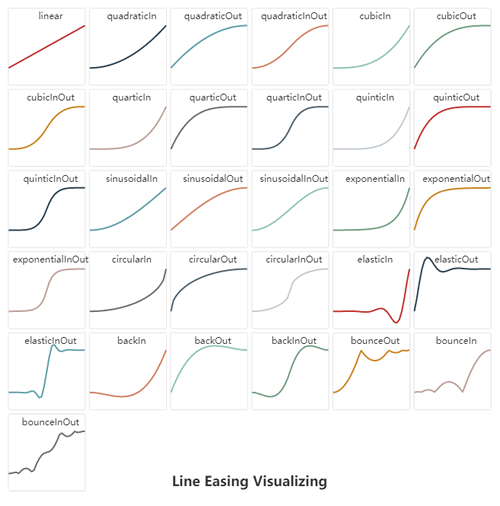

## Function Plot

[参考](https://echarts.apache.org/examples/zh/editor.html?c=line-function)

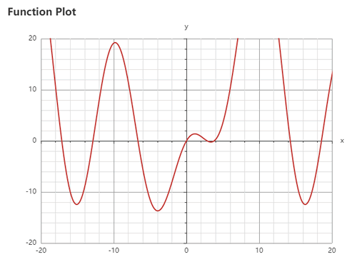

新的知识点：

- minorTick : 坐标轴上的次刻度.
- minorSplitLine : 次刻度线.

## Line Gradient

[参考](https://echarts.apache.org/examples/zh/editor.html?c=line-gradient)

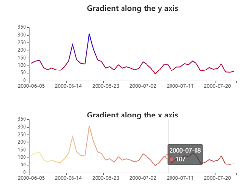

## Custom Graphic Component

[参考](https://echarts.apache.org/examples/zh/editor.html?c=line-graphic)

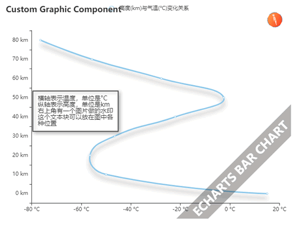

新的知识点：

- formatter : 支持各类字符串模板，如：{a},{b}...
- graphic : 支持自定义图形.
- graphic.type = 'image' : 图片, origin 指定图片的原点，缩放，旋转都参考原点.
- graphic.type = 'group' : 组.
- graphic.type = 'text' : 文本.

## Temperature Change in the coming week

[参考](https://echarts.apache.org/examples/zh/editor.html?c=line-marker)

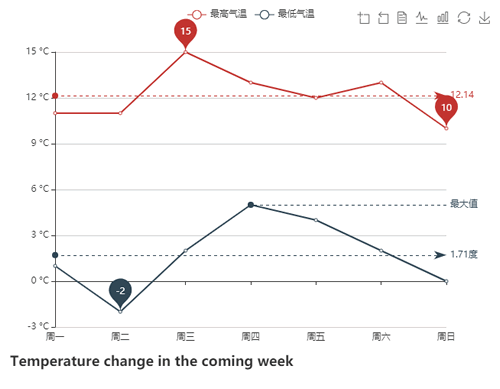

新的知识点：

- toolbox.feature.dataView : 显示源数据.
- toolbox.feature.magicType : 可以提供自动切换 series 的 type.

## Line with Marklines

[参考](https://echarts.apache.org/examples/zh/editor.html?c=line-markline)

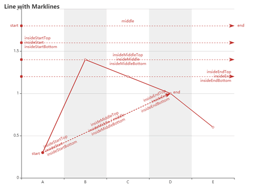

新的知识点：

- splitArea.show : 是否显示坐标轴分块区域背景

## Click to Add Points

[参考](https://echarts.apache.org/examples/zh/editor.html?c=line-pen)

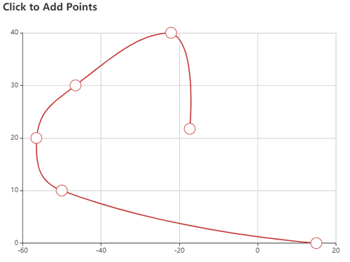

新的知识点：

- getZr() : 获得图表对应的 ZRender 实例.

## Two Value Axes in Polar 1

[参考](https://echarts.apache.org/examples/zh/editor.html?c=line-polar)

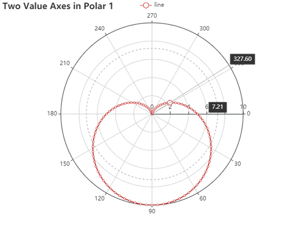

新的知识点：

- 极坐标 : 需要同时设置 angleAxis, radiusAxis, polar, series 中的数据设置 coordinateSystem: 'polar'.

## Two Value Axes in Polar 2

[参考](https://echarts.apache.org/examples/zh/editor.html?c=line-polar2)

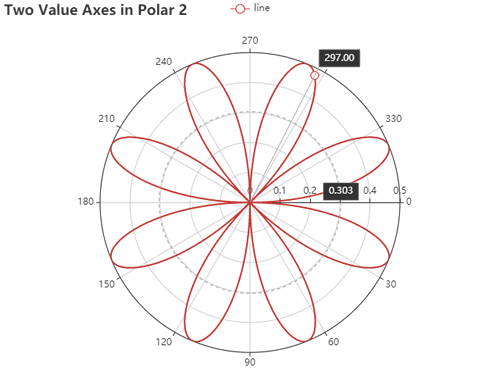

## Distribution of Electricity

[参考](https://echarts.apache.org/examples/zh/editor.html?c=line-sections)

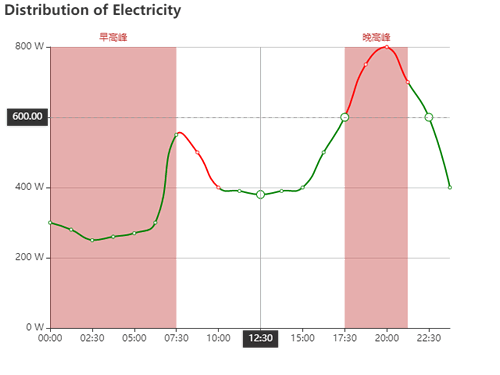

## Step Line

[参考](https://echarts.apache.org/examples/zh/editor.html?c=line-step)

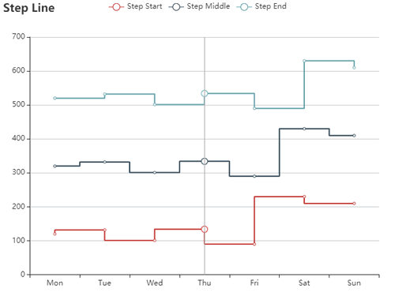

新的知识点：

- step : 折线位置，start, middle, end .

## Line Style and Item Style

[参考](https://echarts.apache.org/examples/zh/editor.html?c=line-style)

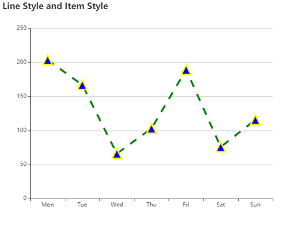

## Tooltip and DataZoom on Mobile

[参考](https://echarts.apache.org/examples/zh/editor.html?c=line-tooltip-touch)

新的知识点：

- axisTick : 设置坐标轴上的刻度.
- handle : 坐标轴上的手柄.
- z : 调整显示层级，数值越大越在上方.

## Line Y Category

[参考](https://echarts.apache.org/examples/zh/editor.html?c=line-y-category)

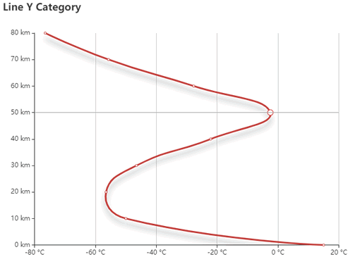

新的知识点：

- axisLine.onZero : true 坐标轴线将会出现在数值 0 所在的位置，false 坐标轴线将会出现在最边上.

## Multiple X Axes

[参考](https://echarts.apache.org/examples/zh/editor.html?c=multiple-x-axis)

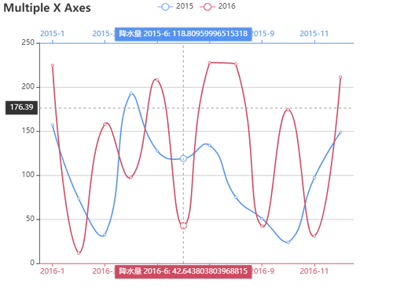

## Share Dataset

[参考](https://echarts.apache.org/examples/zh/editor.html?c=dataset-link)

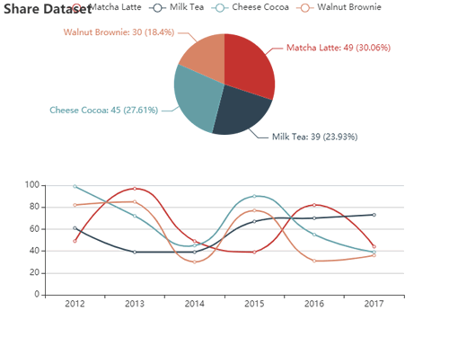

新的知识点：

- dataset : 多组数据可以直接放在 dataset 中.
- seriesLayoutBy : 在 series 中指定这组数据是使用的 dataset 中的一行数据还是一列数据.

# 柱状图 (Bar)

## 柱状图动画延迟 (Bar Animation Delay)

[参数](https://echarts.apache.org/examples/zh/editor.html?c=bar-animation-delay)

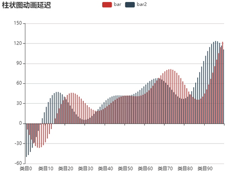

新的知识点：

- animationDelay : 控制动画延迟时间.
- pixelRatio : 保存图片的像素密度，2 = 原 canvas 宽高 X 2.

## Bar with Background

[参考](https://echarts.apache.org/examples/zh/editor.html?c=bar-background)

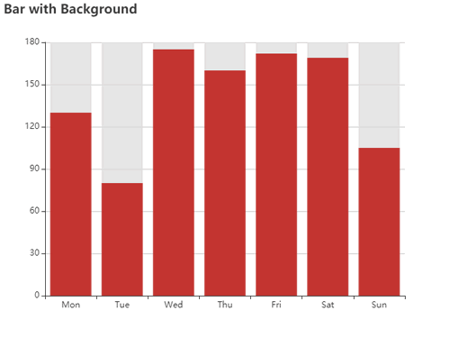

新的知识点：

- showBackground : 可以设置让 bar 显示一个100%高度的背景.

## 柱状图框选 (Bar Brush)

[参考](https://echarts.apache.org/examples/zh/editor.html?c=bar-brush)

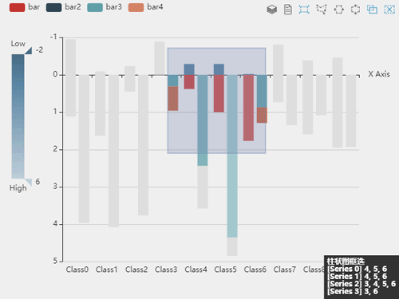

新的知识点：

- emphasis : 选中样式.
- visualMap.calculable : 可自行控制范围.
- colorLightness : 明暗度.
- brush : 选边工具.

## 特性示例：渐变色 阴影 点击缩放 (Bar Gradient)

[参考](https://echarts.apache.org/examples/zh/editor.html?c=bar-gradient)

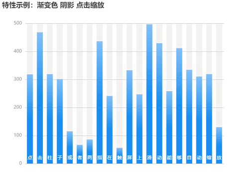

新的知识点：

- dispatchAction : {type: 'dataZoom'} 触发dataZoom事件

## Bar Label Rotation

[参考](https://echarts.apache.org/examples/zh/editor.html?c=bar-label-rotation)

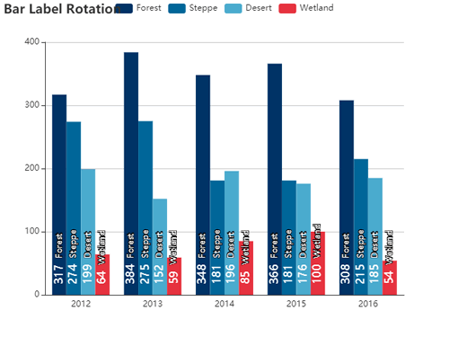

新的知识点：

- toolbox.orient : 工具按钮是横排还是竖排.
- dataView.readOnly : 数据视图的数据是否为只读.
- rich : 可以为 formatter 配置自定义的模板样式.

## Large Scale Bar Chart

[参考](https://echarts.apache.org/examples/zh/editor.html?c=bar-large)

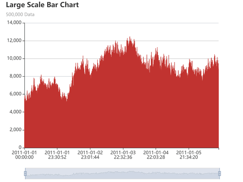

新的知识点：

- echarts.format.addCommas : 数字 1000 转化成 1,000 .
- large : 当数据量过大时，设置 large=true 可以让 echart 优化显示（即分批显示数据）否则图表会长时间卡顿.

## 正负条形图 (Bar Negative)

[参考](https://echarts.apache.org/examples/zh/editor.html?c=bar-negative)

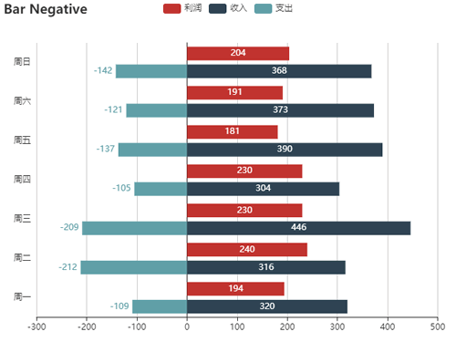

新的知识点：

- tooltip.axisPointer.type : 默认为 line (直线), 其他参数 shadow .

## 交错正负轴标签 (Bar Negative2)

[参考](https://echarts.apache.org/examples/zh/editor.html?c=bar-negative2)

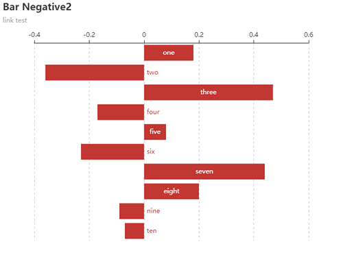

新的知识点：

- link / sublink : 可以指定 title 中 text / subtext 的指向链接.

## 极坐标系下的堆叠柱状图 (Bar Polar)

[参考](https://echarts.apache.org/examples/zh/editor.html?c=bar-polar-real-estate)

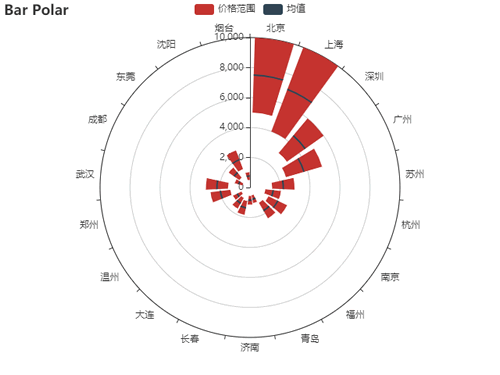

## 极坐标系下的堆叠柱状图2 (Bar Polar Stack)

[参考](https://echarts.apache.org/examples/zh/editor.html?c=bar-polar-stack)

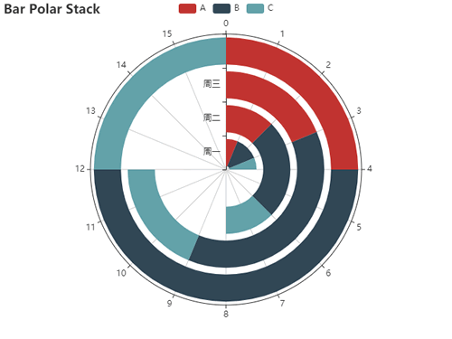

新的知识点：

- radiusAxis : 半径坐标轴.

## 极坐标系下的堆叠柱状图3 (Bar Polar Stack Radial)

[参考](https://echarts.apache.org/examples/zh/editor.html?c=bar-polar-stack-radial)

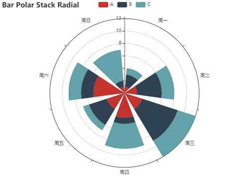

新的知识点：

- angleAxis : 扇形坐标轴.

## Weather Statistics

[参考](https://echarts.apache.org/examples/zh/editor.html?c=bar-rich-text)

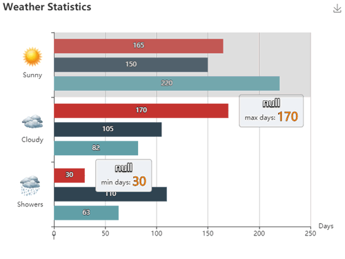

新的知识点：

- backgroundColor.image : 可以指定图片.

## 堆叠柱状图 (Bar Stack)

[参考](https://echarts.apache.org/examples/zh/editor.html?c=bar-stack)

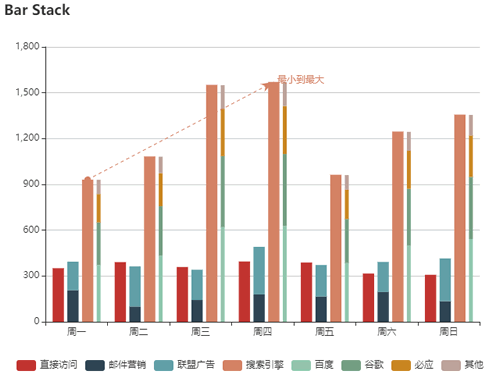

新的知识点：

- barWidth : 可以指定 bar 的宽度.

## 坐标轴刻度与标签对齐 (Bar Tick Align)

[参考](https://echarts.apache.org/examples/zh/editor.html?c=bar-tick-align)

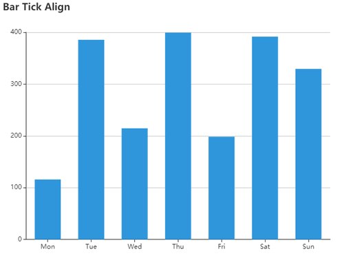

新的知识点：

- axisTick.alignWithLabel : 刻度与 label 对齐.

## 深圳月最低生活费组成 (Bar Waterfall)

[参考](https://echarts.apache.org/examples/zh/editor.html?c=bar-waterfall)

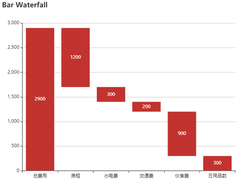

## 阶梯瀑布图 (Bar Waterfall2)

[参考](https://echarts.apache.org/examples/zh/editor.html?c=bar-waterfall2)

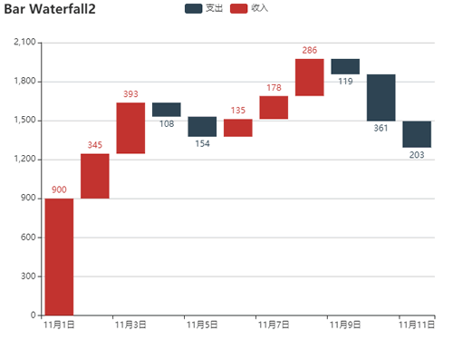

## World Total Population

[参考](https://echarts.apache.org/examples/zh/editor.html?c=bar-y-category)

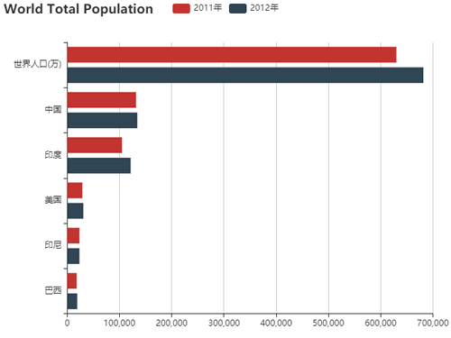

## 堆叠条形图 (Bar Y Stack)

[参考](https://echarts.apache.org/examples/zh/editor.html?c=bar-y-category-stack)

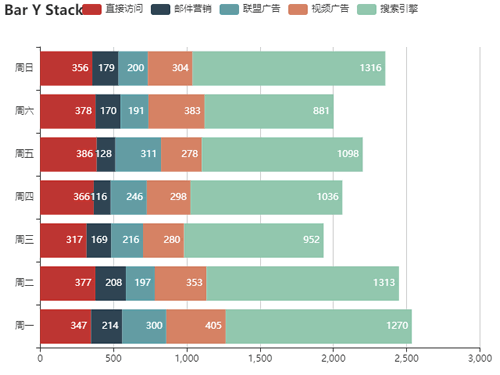

## Rainfall and Evaporation

[参考](https://echarts.apache.org/examples/zh/editor.html?c=bar1)

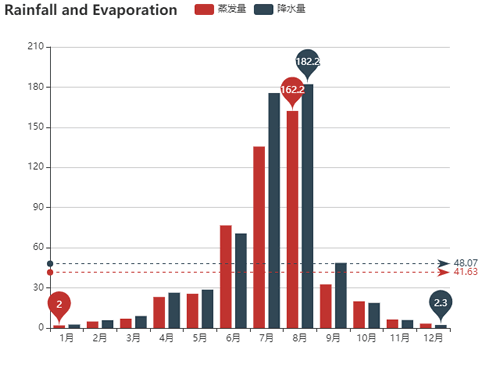

## Dynamic Data

[参考](https://echarts.apache.org/examples/zh/editor.html?c=dynamic-data)

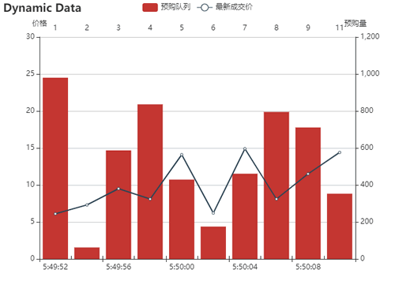

## Mixed Line and Bar

[参考](https://echarts.apache.org/examples/zh/editor.html?c=mix-line-bar)

## Finance Indices 2002

[参考](https://echarts.apache.org/examples/zh/editor.html?c=mix-timeline-finance)

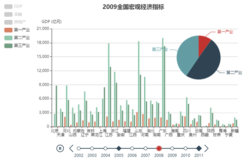

新的知识点:

- timeline: 时间轴功能.
- symbol: 设置符号形状, diamond 菱形.
- legend.selected: 设置图示默认是否选中.

## Mix Zoom on Value

[参考](https://echarts.apache.org/examples/zh/editor.html?c=mix-zoom-on-value)

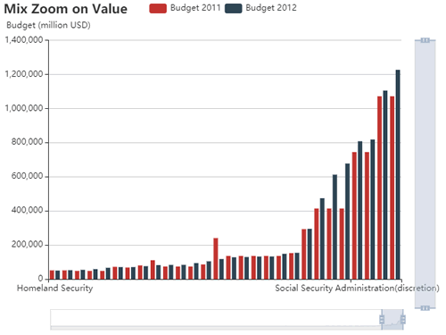

## Multiple Y Axes

[参考](https://echarts.apache.org/examples/zh/editor.html?c=multiple-y-axis)

## Rounded Bar on Polar

[参考](https://echarts.apache.org/examples/zh/editor.html?c=polar-roundCap)

## Watermark - ECharts Download

[参考](https://echarts.apache.org/examples/zh/editor.html?c=watermark)

新的知识点:

- backgroundColor: 可以指定 image 加 repeat 生成水印效果. image 可以指定 canvas.

# 饼图 (Pie)

## Pie Label Align

[参考](https://echarts.apache.org/examples/zh/editor.html?c=pie-alignTo)

新的知识点:

- label.alignTo: 不同的对齐模式.

## Customized Pie

[参考](https://echarts.apache.org/examples/zh/editor.html?c=pie-custom)

新的知识点:

- roseType: 变为玫瑰图.

## Doughnut Chart

[参考](https://echarts.apache.org/examples/zh/editor.html?c=pie-doughnut)

# 散点图 (Scatter)

## Basic Scatter Chart

[参考](https://echarts.apache.org/examples/zh/editor.html?c=scatter-simple)

## Bubble Chart

[参考](https://echarts.apache.org/examples/zh/editor.html?c=bubble-gradient)

# 地理坐标/地图 (GEO/Map)

## A Hiking Trail in Hangzhou - Baidu Map

[参考](https://echarts.apache.org/examples/zh/editor.html?c=lines-bmap)

新的知识点:

- bmap: 需要引入 bmap.js 和 api.js (百度地图相关)

## Bus Lines of Beijing - Baidu Map

[参考](https://echarts.apache.org/examples/zh/editor.html?c=lines-bmap-bus)

## Bus Lines of Beijing - Line Effect

[参考](https://echarts.apache.org/examples/zh/editor.html?c=lines-bmap-effect)

新的知识点:

- modifyHSL: zrender 包下的 color 方法, 提供了一个 HSL 转成 rgba 的方法.
- effect: 提供运动点功能.

## Use lines to draw 1 million ny streets

[参考](https://echarts.apache.org/examples/zh/editor.html?c=lines-ny)

*未实现*

## Binning on Map

[参考](https://echarts.apache.org/examples/zh/editor.html?c=map-bin)

新的知识点:

- renderItem: 可以自定义要怎样渲染 item.

# 数据集 (Dataset)

## Simple Example of Dataset

[参考](https://echarts.apache.org/examples/zh/editor.html?c=dataset-simple0)

新的知识点:

- dataset: 可以直接指定数据源, 让 series 序列可以只关心图表层面.

## Dataset in Object Array

[参考](https://echarts.apache.org/examples/zh/editor.html?c=dataset-simple1)

新的知识点:

- dimensions: 定义 series.data 或者 dataset.source 的每个维度的信息. 默认会从 dataset 的第一行/列中获取维度信息, 但如果定义了 dimensions, 将不再会将 dataset 的第一行/列作为维度信息.

## Default Arrangement

[参考](https://echarts.apache.org/examples/zh/editor.html?c=dataset-default)

新的知识点:

- encode: value 指定 datasource 中的具体数据.

## Simple Encode

[参考](https://echarts.apache.org/examples/zh/editor.html?c=dataset-encode0&theme=light)

新的知识点:

- encode: bar 类图表, 通过 x, y 指定 datasource 中的具体维度.

## Series Layout By Column or Row

[参考](https://echarts.apache.org/examples/zh/editor.html?c=dataset-series-layout-by&theme=light)

新的知识点:

- seriesLayoutBy: 系列数据是依据 dataset 中的行还是列. 默认 column, row: 行

## Encode and Matrix

[参考](https://echarts.apache.org/examples/zh/editor.html?c=dataset-encode1&theme=light)

## Share Dataset

[参考](https://echarts.apache.org/examples/zh/editor.html?c=dataset-link)

# 3D 柱状图 (3D Bar)

## 3D Bar with Dataset

[参考](https://echarts.apache.org/examples/zh/editor.html?c=bar3d-dataset&gl=1)

## Image to Bar3D

[参考](https://echarts.apache.org/examples/zh/editor.html?c=image-to-bar3d&gl=1)

通过 canvas.drawImage 拿到图片的像素点, 通过计算像素点的灰度值, 决定 bar 的 z(即高度).

*注意: 图片可以通过 img.src 设置 base64, 但是加载天空盒仍然需要一个基础的 webserver 环境.*

end

