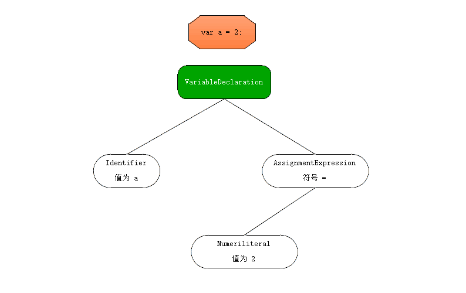

# Part1. 作用域和闭包

## 1. 作用域是什么?

几乎所有编程语言最基本的功能之一就是能够储存变量中的值, 并在之后对其进行访问或修改. 这种能力使得程序有了状态.

那么变量中的值放在哪里? (或者说储存在哪里?)

更重要的是程序如何找到它们? 这需要设计一套良好的规则来储存变量, 并在之后方便的找到它们, 这套规则称为作用域.

### 1.1 编译原理

通常称 Javascript 为 "解释执行" 或 "动态" 语言, 但事实上它是一门编译语言. 只不过它不是提前编译的, 编译结果也不能在分布式系统上进行移植.

传统编译语言, 一段源代码在执行之前的三个步骤: (统称为编译)

1. 分词 / 词法分析 (Tokenizing / Lexing)

   将字符串分解成有意义的代码块, 这些代码块被称为词法单元 (token)

   ```
   如: var a = 2;
   会被分析为: var、a、=、2、;
   空格取决于在这门语言中是否有意义 (如 python 之类用空格缩近作为语句层级的语言)
   ```

2. 解析 / 语法分析 (Parsing)

   这个过程会将词法单元流 (往往是一个数组), 转换成 "抽象语法树" (AST: Abstract Syntax Tree)

   ```
   如: var a = 2; 通过步骤1的词法分析转换成了类似这样一个数组 ['var','a','=','2',';']
   那么转换成 AST 可能会有一个 VariableDeclaration 的顶级节点
   接下来会有一个 Identifier (它的值为a) 的子节点
   以及一个 AssignmentExpression 的子节点
   这个子节点还会有一个 Numericliteral (它的值为2) 的子节点
   ```

   可能的 AST 长这样:
   

   或者可以通过更官方的工具查看:

   [在线 AST 查看](https://astexplorer.net/)

3. 代码生成

   将 AST 转换为可执行代码的过程被称为代码生成, 这个过程与编程语言, 目标平台等息息相关.

   抛开细节, 它就是这种可以将 `var a = 2;` 的 AST 转化为一组机器指令的方法.

   ```
   创建一个叫作 a 的变量 (包含内存分配等操作), 并将一个值 (数字: 2) 存到 a 中.
   ```

比起上述的三个步骤, Javascript 引擎编译要复杂的多. 比如在语法分析和代码生成阶段会有特定步骤对运行性能进行优化, 对冗余元素进行优化等.

Javascript 引擎不会有大量时间进行优化, 因为 Javascript 代码片断往往只在被执行前的几微秒 (甚至更短) 的时间内编译, Javascript 引擎会用尽各种办法 (如: JIT 或 延迟编译, 甚至实施重编译) 来保证性能最佳.

```
更多资料可以查找 V8 TurboFan 相关内容
延迟编译: Javascript 首次编译时, 部分函数仅会标记但不编译. 只有在真的执行到时, 才会编译并执行. 最常见的例子, 鼠标点击事件函数往往仅在用户第一次点击触发事件时, 这个函数才开始编译.
```

[代码](1.html)

```
会发现的在 Chrome 浏览器下 (IE 下无效果, 且很慢), 后几次点击后执行 fn 的时间会明显比前二次快.
```

代码一旦编译完成, 作好执行前的准备后, 通常就会马上执行它们了.

### 1.2 理解作用域