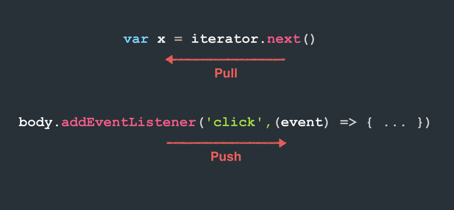

[参考资料](https://blog.jerry-hong.com/series/rxjs/)

> RxJS 版本: 6.5.4

# 00: 安利RxJS

## 1. 响应式编程的兴起

响应式编程 (Reactive Programming).

Vue 底层是以响应式编程的概念来设计的.

## 2. Observable 标准化

未来ECMAScript的标准, 目前TC39 Stage1阶段.

## 3. 多语言支持

主流语言都有Rx的库, 如:RxJava, RxPy, RxRuby等.

# 01: 认识 RxJS

## 1. 异步常见问题

- 竞态条件 (Race Condition)

  当对同一资源作多次异步操作时, 可能会发生竞态条件问题.

  如: 更新用户信息 (Request1) 的同时再请求获得用户信息 (Request2), 二个请求的先后顺序会造成最终结果的不同.

- 内存泄漏 (Memory Leak)

  在SPA (Single Page Application)中, 并不是像传统网站那样全部整页刷新的, 而是通过 Javascript 实现页面内容切换的, 这样对 DOM 注册的事件, 一旦没有在适当的时间移除, 就会造成内存泄漏.

  如: A页面监听了 body 的 scroll 事件, 但页面切换时, 并没有将 scroll 的监听事件移除.

- 复杂状态 (Complex State)

  页面操作都是异步行为时, 每次行为都会改变程序中的一个状态, 导致状态可能会非常复杂.

  如: 播放付费电影这个业务, 首先要抓取影片的信息, 然后再在播放时还要验证用户是否有权限播放. 同时, 用户也可能在按下播放后,马上又按了取消. 以上行为都可以是异步操作, 这时就会有各种复杂的状态需要处理.

- 错误处理 (Exception Handling)

  Javascript 通过 try/catch 可以捕获同步的错误, 但异步的错误就会比较麻烦[^注1-1], 特别时异步操作非常复杂时, 问题尤为明显.

[^注1-1]: async/await 捕获异步操作应该还好吧.

## 2. 各种不同的 API

常见的异步 API:

- DOM Events
- XMLHttpRequest
- Fetch
- WebSockets
- Server Send Events
- Service Worker
- Node Stream
- Timer

以上的异步 API, 每种都有各自独特的写法! 如果使用RxJS, 可以统一通过 RxJS 处理, 这样就能使用统一的 API 操作了.(RxJS 的 API)

例子: 监听点击事件

```javascript
// 原生 JavaScript
const handler = e => {
    console.log(e); // 打印
    document.body.removeEventListener('click', handler); // 执行一次后移除事件
};
document.body.addEventListener('click', handler); // 注册事件

// Rx 大概的样子
Rx.Observable
	.formEvent(document.body, 'click') // 注册事件
	.take(1) // 只执行一次(即执行一次后移除事件)
	.subscribe(console.log); // 事件发生时,执行打印操作
```

## 3. RxJS 基本介绍

RxJS 是一个由一系列 Observable 组合起来的处理异步和事件的库.

> 可以把 RxJS 当作是处理异步的Lodash.

RxJS 也被称为 Functional Reactive Programming (FRP), 但更准确的来说应该是 Functional Programming[^注1-2] 和 Reactive Programming[^注1-3] 二种编程思想的结合.

[^注1-2]: 面向函数编程
[^注1-3]: 响应式编程

## 4. 关于 Reactive Extension (Rx)

Rx 最早是微软开发的 LinQ[^注1-4] 的一种扩展. 它的目标是对异步的集合进行操作.

[^注1-4]: LinQ 念作 Link, 全称是 Language-Integrated Query; 学习 RxJS 不用会 LinQ;

## 5. 关于函数响应编程 Functional Reactive Programming

FRP 是一种编程范式(programming paradigm), 类似 OOP 其实也是一种编程范式.

OOP 让我们使用面向对象的方法来思考问题, 编写程序. FRP 则是包含了 Functional Programming 和 Reactive Programming 二种编程思想.

面向函数编程 (Functional Programming):

使用面向函数的方式思考问题, 编写代码.

Reactive Programming:

当变量或资源发生改变时, 由变量或资源主动通知我发生了改变.

如: Vue.js 的双向绑定, 就是通过 ES5 的 definedProperty 的 getter/setter 实现当变量发生改变时, 就执行 getter/setter, 从而外界依赖这个变量的地方都能知道变量发生了改变. 这也被称作为依赖收集.

# 02: 面向函数编程基本概念

## 1. 什么是面向函数编程

面向函数编程 (Functional Programming) 就是让我们使用 function 来思考和解决问题.

比如下面这个运算的例子: 

```
(5 + 6) - 1 * 3
```

可以写成这样:

```javascript
const add = (a, b) => a + b;
const mul = (a, b) => a * b;
const sub = (a, b) => a - b;
sub(add(5, 6), mul(1, 3));
```

我们把每个运算单独写成一个个不同的 function , 并使用这些 function 组合出我们想要的结果. 这就是最简单的面向函数编程.

## 2. 面向函数编程的基本条件

就像不是所有语言都支持 OOP 一样, 也不是所有语言都支持 FP 的. 要能够支持 FP 的语言至少需要满足一个条件.

> 函数必须是一等公民.

- 函数要能够赋值给变量

  ```javascript
  const hello = function () {};
  ```

- 函数能够作为参数传递

  ```javascript
  fetch('www.google.com')
      .then(function(response) {});
  ```

- 函数能够被当作返回值

  ```javascript
  function (a) {
      return function (b) {
          return a + b;
      };
  }
  ```

## 3. 面向函数编程的特点

### 3-1: 表达式而不是语句 (Expression, no Statement)

FP 都是表达式 (Expression) 而不是语句 (Statement).

表达式是一种运算过程, 一定会有返回值. 比如执行一个 function:

```javascript
add(1, 2)
```

语句则表现为某种行为. 比如给一个变量赋值:

```javascript
a = 1
```

> 有时候表达式也可能同时是合法的语句, 深入了解二者的区别可以参考 [Expressions versus statements in JavaScript](https://2ality.com/2012/09/expressions-vs-statements.html)

### 3-2: 纯函数

纯函数 (Pure Function) 指只要给一个 function 相同的参数, 得到的返回值应该也是完全相同的. 并且不会有其他显著的副作用 (Side Effect).

```javascript
const arr = [1, 2, 3, 4, 5];
arr.slice(0, 3); // [1, 2, 3]
arr.slice(0, 3); // [1, 2, 3]
arr.slice(0, 3); // [1, 2, 3]
// 这里的 slice 不管执行几次, 返回值都是相同的, 并且除了返回一个值以外, 没有做任何其他事情. 所以这个 slice 就是一个纯函数.
```

```javascript
const arr = [1, 2, 3, 4, 5];
arr.splice(0, 3); // [1, 2, 3]
arr.splice(0, 3); // [4, 5]
// 换成使用 splice , 因为 splice 每执行一次都会影响 arr 的值, 导致每次返回的结果都不同. 所以 splice 明显就不是一个纯函数, 它有一个明显的副作用, arr 被改变了.
```

#### 3-2-1: 无副作用

副作用 (Side Effect) 是指一个 function 做了跟本身运算返回值无关的事情. 比如修改了全局变量, 或者修改了传入的参数等. 甚至是执行 console.log 都能算是副作用.

在 FP 里强调没有副作用, 也就是说 function 要保持纯粹, 只做运算并返回值, 没有其他额外的行为.

前端常用的副作用举例:

- 发送 http request
- 打印值或者写日志
- 获得用户的 input
- Query DOM

#### 3-2-2:  引用透明

引用透明 (Referential transparency), 即要求纯函数不管外部环境如何, 只要参数相同, 函数的返回结果必定也相同. 这种不依赖任何外部状态, 只依赖传入参数的特性也被称为引用透明. 

### 3-3: 利用参数保存状态

Redux 的状态是由各个 reducer 组成的, 每个 reducer 的状态是保存在参数中的.

```javascript
function countReducer(state = 0, action) {
    // return newState
}
```

递归[^注2-1], 通过递归调用 findIndex 查找元素位置. 由参数 start 来保存当前找到第几个 index 的状态.

```javascript
function findIndex(arr, predicate, start = 0) {
    if(0 <= start && start < arr.length) {
        if(predicate(arr[start])) {
            return start;
        }
        return findIndex(arr, predicate, start+1);
    }
}
findIndex(['a', 'b'], x => x === 'b');
```

[^注2-1]: 递归会制造多层 stack frame, 导致运算速度降低. ES6 提供了 tail call optimization, 让我们有办法优化递归调用.

## 4. 面向函数编程的优点

### 4-1: 可读性

```javascript
[9, 4].concat([8, 7]) // 拼接数组
	.sort() // 排序
	.filter(x => x > 5); // 过滤大于5的数字
```

### 4-2: 可维护性

因为纯函数的特性, 执行结果不会依赖外部状态, 也不会对外部环境有任何操作. 使得 FP 能够更方便的检查错误以及编写单元测试.

### 4-3: 更易于并行/并发处理

因为基本上只做运算不做 I/O, 再加上没有副作用的特性, 所以不容易出现死锁 (deadlock) 等问题.

> 并发, 就像1个人 (cpu) 同时喂2个孩子 (程序), 每人轮流喂1口, 表面上来看2个孩子都在吃饭.
>
> 并行, 就是2个人喂2个孩子, 2个孩子也是同时在吃饭.

# 03: 面向函数编程中的枚举函数

RxJS 中核心的 Observable 的操作概念和 FP 中的数组枚举操作很相近。

forEach: 是 JavaScript 从 ES5 开始提供的一种遍历(枚举)数组的方法. 接下来通过 forEach 来实现 map, filter, concatAll 方法[^注3-1].

[^注3-1]: 虽然 ES5 已经提供了原生的 map/filter 等方法. 但再次实现一遍有助于理解.

## 1. map

[代码 03-map](codes/03-map.js)

## 2. filter

[代码 03-filter](codes/03-filter.js)

## 3. concatAll

[代码 03-concatAll](codes/03-concatall.js)

# 04: 什么是 Observable ?

整个 RxJS 的基础就是 Observable.

要理解 Observable 之前, 要先了解二个设计模式 (Design Pattern), 迭代器模式 (Iterator Pattern) 和 观察者模式 (Observer Pattern)

## 1. 观察者模式

观察者模式经常会用到, 许多 API 的设计上都会使用观察者模式. 最简单的例子就是 DOM 的事件监听.

```javascript
document.body.addEventListener('click', function (event) {
	console.log('click');
});
```

[代码 04-observer](codes/04-observer.js)

观察者模式主要就是为了让事件和监听者去除耦合.

## 2. 迭代器模式

迭代器 (Iterator) 其实就是一个指针 (pointer), 它会指向一个集合并产生一个序列 (sequence), 这个序列里面有集合中所有的元素 (element).

[代码 04-iterator](codes/04-iterator.js)

> JavaScript 到了 ES6 才有原生的迭代器.
>
> 在 ECMAScript 中迭代器最早采用的是类似 Python 的迭代器规范, 即迭代器在没有元素之后再执行 next 方法, 会直接抛出错误. 但后来经过一段时间讨论后, 决定采用更函数(functional) 的做法, 改成在取得最后一个元素之后执行 next 方法将永远返回 { done: true, value: undefined }.

迭代器模式有二个优点:

1. 因为它是渐进式的获取内容的, 所以可以用来做延迟运算 (Lazy evaluation), 可以更好的处理大量数据.
2. 因为迭代器本身是一个序列, 所以就可以对这个序列使用所有数组的相关方法, 如: map, filter 等.

## 3. 补充: 延迟运算 

延迟运算 (Lazy evaluation), 也称为 call-by-need, 是一种运算策略 (evaluation strategy). 通俗的讲, 就是我们让表达式并不是马上去运行, 而是延迟到我们需要表达式运算出来的结果时, 才让它开始运算.

[代码 04-lazy](codes/04-lazy.js)

```javascript
function* getNumbers(words) {
  for (let word of words) {
    if (/^[0-9]+$/.test(word)) {
      yield parseInt(word, 10);
    }
  }
}

const iterator = getNumbers('30 天精通 RxJS (04)');
console.log(iterator.next()); // { value: 3, done: false }
console.log(iterator.next()); // { value: 0, done: false }
console.log(iterator.next()); // { value: 0, done: false }
console.log(iterator.next()); // { value: 4, done: false }
console.log(iterator.next()); // { value: undefined, done: true }
```

上面的getNumbers函数, 并不是一将字符串丢进去, 就获得所有字符串中的数字的. 而是必须等到执行 next() 时, 才会做运算. 这就是所谓的延迟运算.

## 4. Observable

在了解了观察者和迭代器后, 我们会发现其实观察者和迭代器有一个共同的特点, 那就是它们都是渐进式 (progressive) 的获得内容的. 区别只在于观察者它是生产者 (Producer), 负责推送内容 (push), 而迭代器是消费者 (Consumer), 它只要获取内容 (pull).



Observable 其实就是上述二种设计模式的结合. 它既具备生产者推送内容的特性, 同时也能像序列一样, 拥有序列处理内容的方法(map, filter...).

更简单的来说, Observable 就是一个序列, 里面的元素会随着时间而推送.

# 05: 创建 Observable

> 一定要分清楚 Observable 和 Observer , 二者不要搞混.

整个 RxJS 说白了就是一个核心三个重点.

核心就是 Observable 再加上相关的操作 (map, filter...).

三个重点分别是

- Observer (观察者)
- Subject
- Schedulers

> redux-observable 就是使用 Subject 实现的

## 1. 创建 Observable (一)

创建 Observable 的方法有很多种, 其中 create 是最基本的方法. create 方法在 Rx.Observable 中, 要传入一个回调函数, 这个回调函数会接收一个观察者 (observer) 参数.

```javascript
const observable = Rx.Observable.create(function(observer) {});
```

> 虽然 Observable 可以被 create, 但通常在实际使用中都是使用 creation operator 像是 from, of, fromEvent, fromPromise 等.

[代码 05-create](codes/05-create.js)

> 虽然订阅 Observable (observable.subscribe()) 和 addEventListener 在行为上很像, 但二者在实现上是有非常大的不同的. 最大的区别在于, 实际上 Observable 本身并没有管理订阅的清单.

[代码 05-createasync](codes/05-createasync.js)

> Observable 可以同时处理同步与异步!

## 2. 观察者 (Observer)

Observable 可以被订阅(subscribe), 或者说可以被观察. 而订阅 Observable 的对象又被称为观察者 (Observer). 观察者有三个方法 (method), 每当 Observable 发生事件时, 便会执行观察者相对应的方法.

观察者的三个方法:

- next: 每当 Observable  发送出新的值, next 方法就会被执行.
- complete: 当 Observable 没有其他的内容可以取得时, complete 方法就会被执行. 在 complete 执行之后, next 方法将不会再起作用.
- error: 每当 Observable 内发生错误时, error 方法就会被执行.

```javascript
const observer = {
  next(value) {
    console.log(value);
  },
  error(error) {
    console.log(error);
  },
  complete() {
    console.log('complete');
  }
};
```

[代码 05-observer](codes/05-observer.js)

观察者可以是不完整的, 它可以只有一个 next 方法

```javascript
const observer = {
  next(value) {
    console.log(value);
  }
};
```

subscribe 方法也可以按 next, error, complete 的顺序依次传入.(主要是有些事件, 如 click, 它可能是一个无限序列, complete 是永远不会被执行的)

```javascript
observable.subscribe(
    value => { console.log(value); },
    error => { console.log('Error: ', error); },
    () => { console.log('complete'); }
);
// observalbe.subscribe 会在内部自动生成一个 observer
```

## 3. Observable 实现细节

Observable 的订阅跟 addEventListener 的实现有很大的差异. addEventListener 本质上是观察者模式的实现, 它的内部会有一份订阅清单, 如代码 04-observer.js 中 的Producer , 它的内部有一份所有监听者的清单 (this.listeners), 在发布通知时, 会逐一执行清单中的监听者. 但 Observable 不是这样实现的, 它的内部并没有一份订阅者清单. 订阅 Observable 的行为比较像是执行了一个对象中的方法, 并把生成的内容传到指定的方法中.

类似这样:

```javascript
function subscribe(observer) {
	observer.next('Jerry');
    observer.next('Anna');
}
subscribe({
    next(value) {
        console.log(value);
    },
    // error, complete...
});
// 这里的 subscribe 是一个 function, 这个 function 执行时会传入一个观察者(observer), 而 subscribe 执行时,内部会再去执行观察者的方法
```

> 订阅一个 Observable 就像是执行一个 function.

# 06: 创建 Observable (二)

Observable 有许多创建对象的方法, 称为 creation operator. 以下是 RxJS 中常用的 creation operator.

- create
- of
- from
- fromEvent
- ~~fromPromise~~ (新版本直接使用 from)
- never
- empty
- throw
- interval
- timer

## of

同步的传递几个值时, 可以使用 of 这个 operator.

[代码 06-of](codes/06-of.js)

## from

of 操作的参数其实就是一个 list. 而 list 在 JavaScript 中最常见的就是数组 (array), 那有没有办法将一个已经存在的数组直接作为参数使用呢?

有的, 可以使用 from 来接收任何可迭代 (iterable) 的参数!

[代码 06-from](codes/06-from.js)

> 因为 ES6 后可迭代 (iterable) 的类型变多了, 所以 fromArray 就被移除了.

[代码 06-from-str](codes/06-from-str.js)

> from 也可以接收字符串, 内部会逐一遍历每个字符.

## ~~fromPromise~~

[代码 06-frompromise](codes/06-frompromise.js)

> 新版本没有 fromPromise 了, 可以直接使用 from 处理 promise.

## fromEvent

我们也可以使用 Event 来创建 Observable, 使用 fromEvent 方法即可.

[代码 06-fromevent](codes/06-fromevent.html)

> fromEvent 的第一个参数是 DOM 对象, 第二个参数是要监听的事件名称.
>
> 取到 DOM 对象的常用方法有: getElementById(); querySelector(); getElementsByTagName(); getElementsByClassName(); 等

## fromEventPattern (补充)

要用 Event 来创建 Observable 对象还有另一个方法 fromEventPattern, 这个方法是给类事件使用的. 所谓的类事件, 可以理解为我们自己创建的其行为与事件相像的对象(即同时具备注册监听与移除监听这二种行为), 就像 DOM Event 有 addEventListener 及 removeEventListener 一样. 比如之前实现的 [Observer Pattern](04-observer.js)就是一个类事件.

[代码 06-fromeventpattern](codes/06-fromeventpattern.js)

> 传入的方法要注意 this 指向的问题.

## empty, never, throw

这几个操作单独看起来没有什么意义, 之后在使用 observables 的合并 (combine), 转换 (transforme) 的方法时, 这些操作将会变得很有用.

### 1: empty

在数学中的 零 (0), 虽然有时候看起来没什么用, 但却非常的重要. 在 Observable 中也有类似的东西, 就是 empty.

[代码 06-empty](codes/06-empty.js)

> empty 会给我们一个空的 observable, 订阅这个 observable, 它会直接发送 complete.
>
> 可以直接把 empty 想成没有做任何事, 但它至少还是会告知你.(complete 还是被执行了)

### 2: never

在数学上有一个跟零 (0) 很像的数字, 那就是无穷( ∞ ). 在 Observable 里我们使用 never 来建立无穷的 observable.

[代码 06-never](codes/06-never.js)

> never 会给我们一个无穷的 observable, 订阅这个 observable 会发生什么事情呢?
>
> ...什么事都不会发生, 它就是一个一直存在但却什么都不会做的 observable.
>
> 可以把 never 想像成一个结束在无穷久之后的 observable, 但我们永远等不到那一天!

### 3: throw

throw 就只做一件事, 那就是抛出错误.

[代码 06-throw](codes/06-throw.js)

> 新版本中没有 throw 了, 使用 throwError 代替.

## interval, timer

这二个操作都与时间有关. 在 JavaScript 中, 我们使用 setInterval 来建立一个持续的行为, 这也能用在 Observable 中.

[代码 06-interval](codes/06-interval.js)

[代码 06-timer](codes/06-timer.js)

## 订阅与取消订阅

有时候在某些行为后我们就不需要这些 observable了, 要做到这件事, 最简单的方法就是取消订阅 (unsubscribe).

[代码 06-unsubscribe](codes/06-unsubscribe.js)

> 返回的 subscription 对象还有其他合并订阅等功能.
>
> Events observable 尽量不要使用 unsubscribe, 通常我们会使用 takeUntil, 在某个事件发生后来完成取消操作.

# 07: Observable Operators & 弹珠图 (Marble Diagrams)

## 1. 什么是Operator ?

~~Operators 就是一个个被附加到 Observable 上的函数, 例如像是 map, filter, contactAll... 等等. 所有这些函数都会拿到原来的 observable 并返回一个新的 observable.~~

RxJS 6 开始使用管线操作(pipe), operators 将不再是 observable 上的函数, 而是统一调用 observable 上的 pipe, 然后传递不同的 operator 来实现. 所以这里再称呼为 observable operators 可能会有不妥.

[代码 07-operator-map](codes/07-operator-map.js)

> 这里的 map 函数接收二个参数. 第一个是原来的 observable, 第二个是 map 的 callback function.
>
> 重点是这里的 map 这个 operator 会返回一个新的 observable.

> 在 RxJS[^注7-1] 的实现中, 其实每个 operator 是通过原来的 observable 的 lift 方法来创建新的 observable的, 这个方法会在返回的新 observable 对象中偷偷添加二个属性, 分别是 source 和 operator, 用来记录原来的对象和当前使用的 operator.
>
> 其实 lift 方法还是用 new Observable(跟 create 一样). 至于为什么要独立出这个方法, 除了更好的封装以外, 主要的原来是为了让使用者能更好的 debug.

[^注7-1]: 原文这里指的是 RxJS 5 的版本.

## 2. 弹珠图 (Marble diagrams)

在介绍事物时, 文字其实是最糟的手段, 虽然文字是平时沟通的基础, 但常常千言万语也比不过一张清楚的图片. 如果我们能确定一套 observable 的图示, 就能让我们更方便的沟通与理解 observable 的各种操作了!

我们把描绘 observable 的图示称为弹珠图 (Marble diagrams), 在网上 RxJS 有非常多的弹珠图, 规则大致上都是相同的. 这里采用类似 ASCII 的方法.

我们用 `-` 来表达一小段时间, 这些 `-` 串起来就代表一个 observable.

```
----------
```

`X` (大写x) 则代表有错误发生

```
---------X
```

`|` 则代表 observable 结束

```
---------|
```

在这个时间序列中, 我们可能会发送值 (value), 如果值是数字则直接用阿拉伯数字取代, 其他类型则用相近的英文符号代表, 这里我们用 `interval` 举例:

```javascript
const source = Rx.interval(1000);
// source 的图示就会像这样:
// -----0-----1-----2-----3--...
```

当 observable 是同步发送值的时候:

```javascript
const source = Rx.of(1,2,3,4);
// source 的图标就会像这样:
// (1234)|
```

小括号代表着同步发生.

另外弹珠图也能够表达操作的前后转换, 例如:

```javascript
const source = Rx.interval(1000);
const newest = source.map(x => x + 1);
// 这时的弹珠图就会像这样:
// source: -----0-----1-----2-----3--...
//			map(x => x + 1)
// newest: -----1-----2-----3-----4--...
```

最上面的是原来的 observable, 中间是 operator, 下面则是新的observable.

[Marble Diagrams 相关资源](https://rxmarbles.com/)

## 3. Operators (一)

### 3-1: map

Observable 的 map 方法使用上跟数组的 map 是一样的.

```javascript
const source = Rx.interval(1000);
// const newest = source.map(x => x + 2); // 这是老版本的写法
// Rx6 开始使用 pipe 管道操作
const newest = source.pipe(map(x => x + 2)); // map 通过 rxjs/operators 获取
```

用弹珠图表示就是:

```
source: -----0-----1-----2-----3--...
		map(x => x + 2)
newest: -----2-----3-----4-----5--...
```

### 3-2: mapTo

mapTo 可以把传递进来的值改成一个固定的值.

```javascript
const source = Rx.interval(1000);
// const newest = source.mapTo(2);
const newest = source.pipe(mapTo(2));
```

用弹珠图表示就是:

```
source: -----0-----1-----2-----3--...
		mapTo(2)
newest: -----2-----2-----2-----2--...
```

### 3-3: filter

filter 在使用上也和数组相同.

```javascript
const source = Rx.interval(1000);
// const newest = source.filter(x => x % 2 === 0);
const newest = source.pipe(filter(x => x % 2 === 0));
```

用弹珠图表示就是:

```
source: -----0-----1-----2-----3-----4--...
		filter(x => x % 2 === 0)
newest: -----0-----------2-----------4--...
```

> map, filter 这些方法其实和数组上的同名方法是相同的操作, 因为这些都是面向函数编程中的通用函数, 就算换个语言也有机会看到相同的命名与相同的用法.
>
> Observable 实际上跟 Array 的 operators(map, filter), 在行为上还是有极大差异的. 当数据量很大时, Observable 的性能会好上非常多.

# 08: 简易拖放操作

## 1. Operators

### 1-1: take

take 是一个很简单的操作, 顾名思意就是取前几个元素后就结束, 如:

[代码 08-take](codes/08-take.js)

这里可以看到, 原来的 source 是会发射出无限元素的, 但这里使用了 take(3) 之后, 就只会取前3个元素了, 取完后就直接结束 (complete).

用弹珠图表示就是:

```
source : -----0-----1-----2-----3--...
		take(3)
example: -----0-----1-----2|
```

### 1-2: first

first 会取到 observable 送出的第1个元素之后就直接结束. 行为跟 take(1) 一致.

[代码 08-first](codes/08-first.js)

用弹珠图表示就是: 

```
source : -----0-----1-----2-----3--...
		first()
example: -----0|
```

### 1-3: takeUntil

takeUntil 经常会被用到, 它可以在某件事件发生时, 让一个 observable 直接发送完成 (complete) 信息, 如下:

[代码 08-takeuntil](codes/08-takeuntil.html)

用弹珠图表示就是:

```
source : -----0-----1-----2-----3--...
click  : --------------------c-----...
		takeUntil(click)
example: -----0-----1-----2--|
```

当 click 一触发, observable 就会直接完成 (complete)

### 1-4: concatAll

有时候一个 observable 发送的元素又是一个 observable, 就像二维数组一样, 数组里面的元素还是数组. 这个时候我们就可以使用 concatAll 把它摊平成一个一维数组. 可以把 concatAll 想像成把所有元素 concat 起来.

[代码 08-concatall](codes/08-concatall.html)

用弹珠图表示就是:

```
click  : ----------c----------c-------...
source : ----------o----------o-------...
				  \			\
				   (123)|	  (123)|
				   	 concatAll()
example: ----------(123)------(123)---...
```

这里要注意的是 concatAll 会处理 source 先发出来的 observable, 必须等这个 observable 结束, 才会再处理下一个 source 发送出来的 observable, 如下:

[代码 08-concatall-order](codes/08-concatall-order.js)

这里的 source 会发送3个 observable, 但是 coancatAll 的行为永远都是先处理第一个 observable, 等到当前处理结束之后, 才会再处理下一个.

用弹珠图表示就是:

```
source : (o1                 o2       o3)|
		  \                  \        \
		   --0--1--2--3--4|   -0-1|    ----0|
		   		concatAll()
example: --0--1--2--3--4-0-1----0|
```

## 2. 拖放操作

[代码 08-drag](codes/08-drag.html)

# 09: Observable Operators (二)

## 1. skip

take 可以取前几个发送的元素, skip 则是可以用来跳过前几个发送出来的元素.

```javascript
const source = Rx.interval(1000);
const example = source.pipe(skip(3));
example.subscribe(console.log);
// 3 -> 4 -> 5 -> ...
```

原来是从0开始的, 现在就变成从3开始了, 但要记住原来的元素等待时间仍然是存在的, 也就是说这个例子中, 取到第一个元素(3)需要等4秒.用弹珠图表示就是:

```
source : ----0----1----2----3----4----5--...
			skip(3)
example: -------------------3----4----5--...
```

## 2. takeLast

除了可以用 take 取前几个之外, 也可以倒过来取最后几个.

```javascript
const source = Rx.interval(1000).pipe(take(6));
const example = source.pipe(takeLast(2));
example.subscribe({
    next:console.log,
    complete() {
        console.log('complete');
    }
});
// 4 -> 5 -> complete
```

这里我们先取前6个元素, 再取最后2个. 所以最后会送出 4, 5, complete. 这里有一个**重点**就是, takeLast 必须是等待到整个 observable 完成 (complete), 才能知道最后的元素有哪些, 并且**同步送出**. 用弹珠图表示就是:

```
source : ----0----1----2----3----4----5|
			takeLast(2)
example: ------------------------------(45)|
```

## 3. last

跟 take(1) 相同, 有一个 takeLast(1) 的简化写法, last() 就是用来取最后一个元素的.

```javascript
const source = Rx.interval(1000).pipe(take(6));
const example = source.pipe(last());
example.subscribe({
    next:console.log,
    complete() {
        console.log('complete');
    }
});
```

用弹珠图表示就是:

```
source : ----0----1----2----3----4----5|
			last()
example: ------------------------------(5)|
```

## 4. concat

concat 可以把多个 observable 对象合并成一个.

[代码 09-concat](codes/09-concat.js)

和 concatAll 一样, concat 必须先等前一个 observable 完成 (complete), 才会继续下一个. 用弹珠图表示就是:

```
source : ----0----1----2|
source2: (3)|
source3: (456)|
			concat()
example: ----0----1----2(3456)|
```

## 5. startWith

startWith 可以在 observable 的一开始塞进要发送的元素.

```javascript
const source = Rx.interval(1000);
const example = source.pipe(startWith(0));
example.subscribe(console.log);
```

这里我们往 source 的一开始就塞了一个0, 让 example 从一开始就会立即发送0, 用弹珠图表示就是:

```
source    : ----0----1----2----3--...
			startWith(0)
example: (0)----0----1----2----3--...
```

> startWith 的值是一开始就同步发送出来的, 这个操作经常被用来保存程序的初始状态.

## 6. merge

merge 跟 concat 一样都是用来合并 observable的, 但二者在行为上有非常大的不同!

```javascript
const source = Rx.interval(500).pipe(take(3));
const source2 = Rx.interval(300).pipe(take(6));
const example = source.pipe(merge(source2));
example.subscribe({
    next:console.log,
    complete() {
        console.log('complete');
    }
});
// 0->0->1->2->1->3->2->4->5->complete
```

merge 会把多个 observable 同时处理, 这和 concat 一次处理一个 observable 是完全不一样的. 由于是同时处理, 行为会变得较为复杂, 这里使用弹珠图表示会比较好解释.

```
source : ----0----1----2|
source2: --0--1--2--3--4--5|
			merge()
example: --0-01--21-3--(24)--5|
```

# 10: Observable Operators (三)

## 1.  combineLatest

[代码 10-combinelatest](codes/10-combinelatest.js)

第一次看到输出的内容会很困惑, 直接来看弹珠图:

```
source : ----0----1----2|
newest : --0--1--2--3--4--5|
			combineLatest(newest, (x, y) => x + y)
example: ----01--23-4--(56)--7|
```

首先 combineLatest 可以接收多个 observable, 最后一个参数是一个回调函数, 这个回调函数接收的参数数量与要合并的 observable 的数量是相同的. 在例子中, 我们合并了二个 observable, 所以回调函数就会接收到 x, y 二个参数. x 会接收到 source 发送出来的值, y 会接收到 newest 发送出来的值. 最后一个**重点**是, 只有当二个 observable 都**曾经发送过值**后, 才会调用回调函数. 所以这段代码是这样运行的:

| 时序 | source | newest |                           回调函数                           |
| :--: | :----: | :----: | :----------------------------------------------------------: |
|  1   |        |   0    |      因为 source 没有发送过任何值, 所以不会执行回调函数      |
|  2   |   0    |        |       此时 newest 最后一次发送的值是 0, 所以 0 + 0 = 0       |
|  3   |        |   1    |                          0 + 1 = 1                           |
|  4   |        |   2    |                          0 + 2 = 2                           |
|  5   |   1    |        |                          1 + 2 = 3                           |
|  6   |        |   3    |                          1 + 3 = 4                           |
| 7.1  |   2    |        | 2 + 3 = 5. 此时 source 结束了, 但 newest 还没结束, 所以 example 还不会结束. |
| 7.2  |        |   4    |                          2 + 4 = 6                           |
|  8   |        |   5    | 2 + 5 = 7. 此时 newest 结束了, 因为 source 也已经结束了, 所以 example 结束 |

> combineLatest 常用在计算多个因子的结果上, 例如最常见的计算 BMI, 当身高发生变化时就会拿上次的体重计算新的 BMI, 同样的当体重发生变化时则会拿上次的身高计算 BMI.

## 2. zip

zip 会取每个 observable 相同顺序位置上的元素传入回调函数, 也就是说每个 observable 的第 n 个元素会一起传入回调函数.

[代码 10-zip](codes/10-zip.js)

用弹珠图表示就是:

```
source : ----0----1----2|
newest : --0--1--2--3--4--5|
			zip(newest, (x, y) => x + y)
example: ----0----2----4|
```

在这个例子中, zip 会等到 source 和 newest 都发送出第一个元素后, 再传入回调函数. 下次回调函数的执行将等到 source 和 newest 都送出了第二个元素后. 所以执行的步骤如下:

| 时序 | source | newest |                           回调函数                           |
| :--: | :----: | :----: | :----------------------------------------------------------: |
|  1   |        |   0    |   这时 source 并没有发送出第一个值, 所以回调函数不会执行.    |
|  2   |   0    |        |        newest 之前发送的第一个值是 0, 所以 0 + 0 = 0         |
|  3   |        |   1    |   这时 source 并没有发送出第二个值, 所以回调函数不会执行.    |
|  4   |        |   2    |   这时 source 并没有发送出第三个值, 所以回调函数不会执行.    |
|  5   |   1    |        |        newest 之前发送的第二个值是 1, 所以 1 + 1 = 2         |
|  6   |        |   3    |   这时 source 并没有发送出第四个值, 所以回调函数不会执行.    |
|  7   |   2    |        | newest 之前发送的第三个值是 2, 所以 2 + 2 = 4. 此时 source 结束, 所以 example 也就直接结束. |

可以利用 zip 来实现原来只能同步发送的数据变成异步的形式, 这种用法很适合做一些示例或者单元测试模拟数据时使用.

[代码 10-zip-hello](codes/10-zip-hello.js)

用弹珠图表示就是:

```
source : (hello)|
source2: -0-1-2-3-4-...
		zip(source2, (x, y) => x)
example: -h-e-l-l-o|
```

> 除非真的有需要, 建议不要乱用 zip. 因为 zip 必须将所有未处理的元素缓存起来. 当我们有二个 observable , 其中一个很快一个很慢时, 就会缓存非常多的元素, 用来等待比较慢的那个 observable. 这很有可能造成内存相关的问题!

## 3. withLatestFrom

withLatestFrom 运行方式和 combineLatest 有点像, 只是它有主从的关系. 只有在主要的 observable 发送出新的值时, 才会执行回调函数.

[代码 10-withlatestfrom](codes/10-withlatestfrom.js)

用弹珠图表示就是:

```
main   : ----h----e----l----l----o|
some   : --0--1--0--0--0--1|
	withLatestFrom(some, (x, y) => y === 1 ? x.toUpperCase() : x)
example: ----h----e----l----L----O|
```

> withLatestFrom 会在 main 发送出值的时候执行回调函数, 但这里有一点要特点注意, 就是如果 main 发送出值时 some 之前并没有发送过任何值, 则回调函数也是不会执行的!

以上示例代码的执行步骤如下:

| 时序 | main | some |                           回调函数                           |
| :--: | :--: | :--: | :----------------------------------------------------------: |
|  1   |      |  0   |                  只在 main 发送值时才会执行                  |
|  2   |  h   |      | 此时 some 上一次发送的值为 0 , 则回调函数('h', 0) 的执行结果为 h |
|  3   |      |  1   |                                                              |
|  4   |      |  0   |                                                              |
|  5   |  e   |      | 此时 some 上一次发送的值为 0 , 则回调函数('e', 0) 的执行结果为 e |
|  6   |      |  0   |                                                              |
| 7.1  |  l   |      | 此时 some 上一次发送的值为 0 , 则回调函数('l', 0) 的执行结果为 l |
| 7.2  |      |  0   |                                                              |
|  8   |      |  1   |                                                              |
|  9   |  l   |      | 此时 some 上一次发送的值为 1 , 则回调函数('l', 1) 的执行结果为 L |
|  10  |  o   |      | 此时 some 上一次发送的值为 1 , 则回调函数('o', 1) 的执行结果为 O |

# 11: 完整的拖放示例

仿优酷的一个拖放效果:

```
在观看优酷的影片时, 可以往下滚动页面. 此时影片就会变成一个小窗口在右下角, 这个窗口可以拖动位置.
这个功能可以让用户一边观看留言的同时又能继续观看影片.
```

[代码 11-page](codes/11-page.html)

# 12: Observable Operators (四)

## 1. scan

scan 其实就是 observable 版本的 reduce, 只是命名不同. 原生 JS 的数组就有 reduce 方法:

```javascript
const arr = [1, 2, 3, 4];
const result = arr.reduce((origin, next) => {
  console.log(origin);
  return origin + next;
}, 0);
console.log(result); // 10
```

[代码 12-scan](codes/12-scan.js)

用弹珠图表示就是:

```
source : ----h----e----l----l----o|
		scan((origin, next) => origin + next, '')
example: ----h----(he)----(hel)----(hell)----(hello)|
```

> scan 跟 reduce 最大的区别就是 scan 一定会返回一个 observable, 而 reduce 最后返回的值有可能是任何类型, 必须要看使用者传入的回调函数才能决定 reduce 最后的返回值.
>
> Jafar Husain 就曾说: JavaScript 的 reduce 是错误的, 它最后应该永远返回一个数组才对!

简单的加减示例:

[代码 12-scan-example](codes/12-scan-example.html)

## 2. buffer

buffer 总共有五个相关的操作:

- buffer
- bufferCount
- bufferTime
- bufferToggle
- bufferWhen

比较常用的是 buffer, bufferCount 和 bufferTime 这三个.

### 2-1: buffer

[代码 12-buffer](codes/12-buffer.js)

用弹珠图表示就是:

```
source : --0--1--2--3--4--5--6--7-...
source2: ---------0---------1-------...
			buffer(source2)
example: ---------([0,1,2])---------([3,4,5])--...
```

buffer 会把原本的 source 发送出的元素缓存到数组中, 等到传入的 source2 发送元素时, 就会触发将缓存的元素发送出去.

### 2-2: bufferTime

上一个示例中 source2 其实就是每一秒发送一个元素, 所以可以改用 bufferTime 更简洁的表述.

[代码 12-buffer](codes/12-buffer.js)

### 2-3: bufferCount

除了用时间来作缓存以外, 我们更常用数量来做缓存.

[代码 12-buffercount](codes/12-buffercount.js)

在实际应用中, 我们可以用 buffer 来做某个事件的过滤. 比如像是鼠标双击操作:

[代码 12-buffer-example](codes/12-buffer-example.html)

上面的示例中, 只有在500毫秒内连点二下以上, 才能成功打印出 '双击'. 

这个功能也能用在批次处理上以降低请求 (request) 的次数.

# 13: Observable Operators (五)

UI 大概是所有异步行为中最不好处理的, 不只是因为它直接影响用户体验, 更大的问题是 UI 互动常常是高频率触发的事件, 而且多个组件间的时序是不一致的. 用 Promise 或 async/await, 很难协调多个不同组件之间的关系, 但是用 RxJS 仍能轻易地处理!

delay 和 delayWhen 这二个操作, 经常在 UI 互动中使用.

## 1. delay

[代码 13-delay](codes/13-delay.js)

从输出信息中很难看出差异, 所以直接看弹珠图:

```
source : --0--1--2--3--4|
		delay(500)
example: -------0--1--2--3--4|
```

从弹珠图可以看出, 第一次发送元素的时间变慢了.

delay 除了可以传入毫秒以外, 也可以传入 Date 类型的变量.

```javascript
const example = source.pipe(delay(new Date(Date.now() + 1000))); // 当前时间后的1000毫秒才开始执行
```

## 2. delayWhen

delayWhen 的作用和 delay 很像, 最大的区别在于 delayWhen 是可以影响每个元素的, 而且需要传入一个返回 observable 的回调函数.

[代码 13-delaywhen](codes/13-delaywhen.js)

当然直接从输出信息中是很难看出差异的, 所以直接看弹珠图:

```
source : --0--1--2--3--4|
		delayWhen(x => Rx.empty().pipe(delay(100 * x * x)))
example: --0---1------2-----------3------------------4|
```

> 13-delaywhen 的执行结果有点奇怪, 0 直接没有了... 具体原因待查.

利用 delay 制作一个多张图片跟着鼠标跑的功能. 注: 每张图片不能跑的一样快.

[代码 13-delay-example](codes/13-delay-example.html)

# 14: Observable Operators (六)

throttle, debounce 在性能优化上是不可或缺的好工具!

## 1. debounce

跟 buffer 和 bufferTime 一样, RxJS 有 debounce 和 debounceTime, 前者传入 observable, 后者传入毫秒, 比较常用到的是 debounceTime.

[代码 14-debouncetime](codes/14-debouncetime.js)

这里只会打印4, 然后就结束了. 是因为 debounce 运行的方式是每次收到元素后, 它会先把这个元素缓存起来并等待一段时间, 如果这段时间内没有收到任何元素, 才会把元素发送出去. 如果这段时间内又收到新的元素, 则会把原来缓存的元素释放掉, 然后重新缓存新的元素并重新计时, 不断反复.

> 如果 observable 结束 (complete) 时, 则 debounce 直接发送出元素.

用弹珠图表示就是:

```
source : --0--1--2--3--4|
		debounceTime(1000)
example: ------------------------4|
```

debounce 会在收到元素后等待一段时间, 这很适合处理间歇行为. 

比如要完成自动补全功能, 输入搜索关键词时, 只有在停止输入一小段时间之后, 才去请求 (request), 而不是每打一个字就发送一次请求 (request).

[代码 14-debouncetime-input](codes/14-debouncetime-input.html)

## 2. throttle

基本上每次看到 debounce 就会想到 throttle, 它们的作用都是要降低事件的触发频率, 但行为上有很大的不同.

跟 debounce 一样, 在 RxJS 中有 throttle 和 throttleTime 二个方法. 前者传入 observable 后者传入毫秒. 比如常用的也是 throttleTime.

[代码 14-throttletime](codes/14-throttletime.js)

跟 debounce 不同的是 throttle 会先发送出元素, 等到有元素被发送后就会沉默一段时间, 等到时间过了后又会开始发送元素.

throttle 比较像是控制行为的最高频率, 也就是说如果我们设定为1000毫秒, 那么该事件频率的最大值就是每秒触发一次, 不会再更快了. 而 debounce 则比较像是必须等待的时间, 要等到一定的时间过了后才会收到元素.

throttle 更适合用在连续的行为上, 比如说 UI 动画的运算过程. 因为 UI 动画是连续的, 像我们之前在做拖动时, 就可以加上 throttleTime(12) , 让 mousemove event 不要发送的太快, 避免画面更新速度跟不上样式切换的速度.

> 浏览器中有一个 requestAnimationFrame API 是专门用来优化 UI 运算的, 通常用这个的效果会比 throttle 好.
>
> RxJS 也能用 requestAnimationFrame 做优化, 而且使用方法也很简单, 这个部分会在 Scheduler 提到.

# 15: Observable Operators (七)

## 1. distinct

如果对 SQL 命令熟悉应该都不会对 distinct 陌生, 它能帮我们把相同值的数据过滤到只留下一条, RxJS 里的 distinct 也是相同的作用.

[代码 15-distinct](codes/15-distinct.js)

用弹珠图表示就是:

```
source : --a--b--c--a--b|
		distinct()
example: --a--b--c------|
```

另外我们还可以传入一个 selector 回调函数, 这个回调函数会传入一个接收到的元素, 然后返回我们真正希望对比的值.

[代码 15-distinct-selector](codes/15-distinct-selector.js)

distinct 还可以传入第二个参数 flushes observable, 它可以用来清除暂存的数据.

[代码 15-distinct-flushes](codes/15-distinct-flushes.js)

用弹珠图表示就是:

```
source : --a--b--c--a--c|
flushes: ------------0---...
		distinct(null, flushes)
example: --a--b--c-----c|
```

其实在 flushes 发送出元素时, distinct 会把暂存的数据清空, 所以之后再接收到元素就又是从头来过了. 这样就不用担心暂存的 Set 会越来越大的问题, 但其实我们平常不太会用这种方式来处理, 通常会用另一个方法 distinctUntilChanged.

## 2. distinctUntilChanged

distinctUntilChanged 跟 distinct 一样会把相同的元素过滤掉, 但 distinctUntilChanged 只会跟最后一次发送出的元素比较, 不会每个都比.

[代码 15-distinctuntilchanged](codes/15-distinctuntilchanged.js)

这里 distinctUntilChanged 只会暂存一个元素, 并在收到新元素时跟暂存的元素对比. 如果一样就不发送, 如果不一样就把暂存的元素换成刚新接收到的元素, 并把新元素发送出去.

```
source : --a--b--c--c--b|
		distinctUntilChanged()
example: --a--b--c-----b|
```

从弹珠图中可以看到, 第二个 c 送出时刚好上一个就是 c 所以就被过滤掉了, 但最后一个 b 则跟上一个不同, 所以没有被过滤掉.

# 16: Observable Operators (八)

错误处理是异步行为中的一大难题, 尤其有多个交错的异步行为时, 更容易凸显错误处理的困难. 接下来看看在 RxJS 中如何处理错误.

## 1. catchError

catch 是很常见的异步错误处理方法, 在 RxJS 中也能够直接用 ~~catch~~ (RxJS 6 中叫 catchError) 来处理错误, 在 RxJS 中的 catchError 可以返回一个 observable 来送出新的值.

[代码 16-catcherror](codes/16-catcherror.js)

这个示例中, 我们每隔 500 毫秒就发送出一个字符串 (string), 并用字符串方法 toUpperCase() 来把字符串改成大写英文字母, 在这个过程中因为某些原因, 送出了一个数值 (number) 2 导致发生了错误 (数值是没有 toUpperCase 方法的), 这时后面的 catchError 就能抓到错误了.

catchError 可以返回一个新的 observable; Promise; Array 或者其他任何 iterable 的对象, 来发送之后的元素.

上面例子的弹珠图如下:

```
source : ----a----b----c----d----2|
			map(x => x.toUpperCase())
         ----A----B----C----D----*|
			catchError(error => Rx.of('h'))
example: ----A----B----C----D----h|
```

也可以在遇到错误后, 让 observable 结束:

[代码 16-catcherror-complete](codes/16-catcherror-complete.js)

这里返回了一个 empty 的 observable 来直接结束 (complete).

另外 catchError 的回调函数能接收第二个参数, 这个参数就是当前的 observable, 我们可以通过返回这个 observable 来做到重新执行.

[代码 16-catcherror-retry](codes/16-catcherror-retry.js)

这里我们直接返回了当前的 observable (其实就是 example) 来重新执行, 弹珠图表示就是:

```
source : ----a----b----c----d----2|
			map(x => x.toUpperCase())
         ----A----B----C----D----*|
			catchError((error, obs) => obs)
example: ----A----B----C----D---------A----B----C----D--...
```

因为只是简单示例, 所以这里会一直无限循环, 实际上通常会用在断线重连的情况.

上面的处理方式有一个简化的写法, 叫做 retry

## 2. retry

如果一个 observable 发生错误了, 重新尝试就可以使用 retry 这个方法.

[代码 16-retry](codes/16-retry.js)

retry() 是无限重试的, 也可以设定只重试几次. retry(1) 表示重试一次.

用弹珠图表示就是:

```
source : ----a----b----c----d----2|
			map(x => x.toUpperCase())
         ----A----B----C----D----*|
			retry(1)
example: ----A----B----C----D---------A----B----C----D----*|
```

## 3. retryWhen

RxJS 还提供了一个方法 retryWhen, 它可以把错误发生的元素放到一个 observable 中, 让我们直接操作这个 observable, 并等到这个 observable 操作完之后, 再重新订阅一次原本的 observable.

[代码 16-retrywhen](codes/16-retrywhen.js)

用弹珠图表示就是:

```
source : ----a----b----c----d----2|
		map(x => x.toUpperCase())
         ----A----B----C----D----*|
		retryWhen(errorObs => errorObs.pipe(delay(1000)))
example: ----A----B----C----D-------------------A----B----C----D--...
```

从上图可以看到后续的重新订阅行为被延迟了1秒, 这里只是为了示范 retryWhen , 实际上我们通常会把 retryWhen 拿来做错误通知或者错误收集.

```javascript
// source: ['a','b','c','d',2]
const example = source.pipe(
	map(x => x.toUpperCase()),
    retryWhen(errorObs => {
        return errorObs.map(err => fetch(...));
    })
);
```

> 这里要注意的是, retryWhen 返回的 observable 预设是无限的, 如果我们把它结束了, 原来的 observable 也会跟着结束.
>
> 所以如果在 retryWhen 中返回 Rx.empty() , 则原来的 observable 也会马上跟着结束.

## 4. repeat

我们有时候可能会想要像上面 retry 一样, 有一个重复订阅的效果, 但是没有错误发生. 这个时候就可以用 repeat 来做到.

[代码 16-repeat](codes/16-repeat.js)

repeat 的行为跟 retry 基本一致, 只是 retry 只有在发生错误时才会触发, 用弹珠图表示就是:

```
source : ----a----b----c|
		repeat(1)
example: ----a----b----c----a----b----c|
```

同样的, 不指定重试次数就表示是无限循环: `repeat()`

模仿即时通信断线时的示例:

[代码 16-example](codes/16-example.html)

# 17: Observable Operators (九)

switch, mergeAll 和 concatAll 三个 operators 是用来处理高阶 (Higher Order) Observable的.

所谓的高阶 Observable, 就是指一个 observable 发送出的还是一个 observable. 就像二维数组一样, 数组中的每个元素都是数组.

## 1. concatAll

concatAll 最重要的就是它会处理完前一个 observable 才会再处理下一个 observable.

[代码 17-concatall](codes/17-concatall.html)

如果上面示例中不使用 `take(3)` , 那么弹珠图就会是这个样子:

```
click  : ---------c-c---------------------c--...
			map(e => Rx.interval(1000))
source : ---------o-o---------------------o--...
                   \ \                     \
                    ----0----1----2----3----4--...
                       ----0----1----2----3----4--...
                                             ----0----1----2----3----4--...
			concatAll()
example: ---------------0----1----2----3----4--...
```

click 事件被转换成了一个 observable , 这个 observable 每一秒发送一个递增的数字, 当我们使用 concatAll 之后会把二维的 observable 摊平成一维的 observable, 但是 concatAll 会一个一个处理, 一定是等前一个 observable 完成 (complete), 才会处理下一个 observable. 因为现在发送出来的 observable 是无限的不会完成 (complete), 导致它永远不会处理后面发送的 observable!

上面的示例中加上 `take(3)`之后, 那么弹珠图就会是这个样子:

```
click  : --------c-c------------------c----...
			map(e => Rx.interval(1000).pipe(take(3)))
source : --------o-o------------------o----...
                  \ \                  \
                   ----0----1----2|
                     ----0----1----2|
                                         ----0----1----2|
			concatAll()
example: --------------0----1----2----0----1----2--...
```

当把 observable 变成有限只发送三个元素时, 就会看到 concatAll 不管二个 observable 发送的时间有多么的相近, 一定会是先处理完前一个 observable 后再处理下一个.

## 2. switchAll

~~switch~~ ( RxJS 6 中叫 switchAll ) 同样也能把二维的 observable 摊平成一维的, 但它们在行为上有很大的不同.

[代码 17-switch](codes/17-switch.html)

用弹珠图表示就是:

```
click  : ----------c-c---------------c--...
			map(e => Rx.interval(1000))
source : ----------o-o---------------o--...
                    \ \               \
                     ----0----1----2----3----4--...
                       ----0----1----2----3----4--...
                                        ----0----1----2----3----4--...
			switchAll()
example: ----------------0-0----1----2----3-0----1--...
```

switchAll 最重要的就是它会在新的 observable 发送后直接处理新的 observable 不管前一个 observable 是否完成 (complete), 每当有新的 observable 发送时, 就会直接把上一个 observable 退订 (unsubscribe), 永远只处理最新的 observable!

## 3. mergeAll

之前的 merge 可以让多个 observable 同时发送元素, mergeAll 也是同样的道理, 它会把二维 observable 转换成一维的, 并且能够同时处理所有的 observable.

[代码 17-mergeall](codes/17-mergeall.html)

用弹珠图表示就是:

```
click  : ----------c-c-----------------c--...
			map(e => Rx.interval(1000))
source : ----------o-o-----------------o--...
                   \ \                 \
                   ----0----1----2----3----4--...
                     ----0----1----2----3----4--...
                                       ----0----1----2----3----4--...
			mergeAll()
example: --------------0-0--1-1--2-2--3-3--(04)-4--...
```

在 mergeAll 中, 所有的 observable 都是并行 (Parallel) 处理的, 也就是说不会像 switchAll 一样退订 (unsubscribe) 原先的 observable, 而是并行处理多个 observable.

另外 mergeAll 还可以输入一个数字, 这个数字代表它同时处理的 observable 的数量.

```javascript
mergeAll(2)
// 如果发送的 observable 有三个, 那么 mergeAll 最多只会同时处理二个 observable, 只有当第一个 observable 结束后, 第三个 observable 才会开始.
// 所以如果使用 mergeAll(1), 其行为就和 concatAll 一模一样了.
```

# 18: Observable Operators (十)

## 1. concatMap

concatMap 其实就是 map 加上 concatAll 的简化写法.

[代码 18-concatmap](codes/18-concatmap.html)

用弹珠图表示就是:

```
source : -----------c--c--------------...
			concatMap(e => Rx.interval(100).pipe(take(3)))
example: -----------0-1-2-0-1-2-------...
```

这种行为经常被用来发送请求 (request):

[代码 18-concatmap-fetch](codes/18-concatmap-fetch.html)

可能需要服务器配合: [代码 18-concatmap-fetch-server](codes/18-concatmap-fetch-server.js)

在这个示例中, 每点击一下就会发送一个 HTTP 请求, 如果快速连续的点击, 可以从开发者工具的 network 看到, 每个请求都是等到前一个请求完成之后, 才会开始发送的.( server 代码中延迟了5秒才会响应)

concatMap 还有第二个参数是一个 selector 回调函数, 这个回调函数会有四个参数, 分别是:

1. 外部 observable 发送的元素
2. 内部 observable 发送的元素
3. 外部 observable 发送的元素的 index
4. 内部 observable 发送的元素的 index

另外这个回调函数的返回值就是我们想要后续处理的值.

## 2. switchMap

switchMap 其实就是 map 加上 switchAll 的简化写法.

[代码 18-switchmap](codes/18-switchmap.html)

用弹珠图表示就是:

```
source : -----------c-c-------------...
			switchMap(e => Rx.interval(100).pipe(take(3)))
example: -----------0-0-----1-----2-...
```

用 switchMap 处理连续多次请求, 结果就是只有最后一次请求的结果才会处理, 前面发送的请求已经不会造成任何前端的副作用 (side effect)了, 这种比较适合只看最后一次请求的场景, 比如自动补全 (auto complete), 我们只需要根据用户最后一次输入的文字, 来显示建议选项即可.

switchMap 跟 concatMap 一样有第二个参数 selector 回调函数, 这部分功能和 concatMap 是一样的.

## 3. mergeMap

mergeMap 其实就是 map 加 mergeAll 的简化写法.

[代码 18-mergemap](codes/18-mergemap.html)

mergeMap 也能传第二个参数 selector 回调函数, 这个回调函数和 concatMap 的第二个参数也是完全一样的. 但 mergeMap 的重点在于我们可以传入第三个参数, 用来限制并行处理的数量.

> RxJS 5 还保留了 mergeMap 的别名叫 flatMap. 二个方法是完全一样的.

switchMap, mergeMap, concatMap 还有一个共同的特性, 就是这三个 operators 可以把第一个参数所返回的 promise 对象直接转换成 observable, 所以我们不用再使用 Rx.from 转换一次了.

```javascript
// 之前的代码 18-concatmap-fetch.html 22行左右的 concatMap(e => Rx.from(getPostData())
// 可以直接改写成 concatMap(e => getPostData())
```

> 如果不确定选用以上三种操作的哪一种时, 就使用 switchMap.
>
> 在使用 concatAll 或 concatMap 时, 要注意内部的 observable 一定要是能够结束的, 且外部 observable 发送元素的速度不能比内部的 observable 结束时间快太多, 不然可能会有内存问题 (memory issues)

# 19: 自动补全的简易实现

[代码 19-example](codes/19-example.html)

[服务端代码 19-server](codes/19-server.js)

# 20: Observable Operators (十一)

之前讲了把高阶 observable 转换成一般 observable 的操作, 这里讲能够把一般的 observable 转换成高阶 observable 的操作. 其实前端不太有机会能够用到这类的操作.

## 1. window

window 总共有五个相关的操作:

- window
- windowCount
- windowTime
- windowToggle
- windowWhen

window 很类似 buffer, 都可以把一段时间内发送的元素拆出来, 只是 buffer 是把元素拆分到数组中的, 而 window 则是会把元素拆分出来放到一个新的 observable 中.

[代码 20-window](codes/20-window.html)

用弹珠图表示就是:

```
source : ----0----1----2----3----4----5----6---...
click  : -----------c----------c------------c--...
			window(click)
example: -----------o----------o------------o--...
                    \          \            \
         ----0----1-|--2----3--|-4----5----6|--...
			switchAll()
       : ----0----1----2----3----4----5----6---...
```

以上这个示例只是为了单纯的表述 window 的作用, 并没有什么太大的意义. 实际上 window 会搭配其他的操作使用, 比如计算一秒钟内触发了几次 click 事件:

[代码 20-window-count](codes/20-window-count.html)

这个例子中把 source 和 click 对调了一下, 并且用到了一个方法 `count()`, 它可以用来取得 observable 总共发送了几个元素, 用弹珠图表示就是:

```
click  : --cc----c-----c-----------------...
source : ---------0---------1---------2--...
			window(source)
example: ---------o---------o---------o--...
                  \         \         \
         --cc----c|----c----|---------|--...
			count()
       : --------3|--------1|--------0|--...
			switchAll()
       : ---------3---------1---------0--...
```

## 2. windowToggle

windowToggle 不像 window 只能控制内部 observable 的结束, windowToggle 可以输入二个参数, 第一个是开始的 observable, 第二个是一个回调函数, 可以返回一个结束的 observable.

[代码 20-windowtoggle](codes/20-windowtoggle.html)

用弹珠图表示就是:

```
source   : ----0----1----2----3----4----5--...
mouseDown: -------D------------------------...
mouseUp  : ---------------------------U----...
			windowToggle(mouseDown, () => mouseUp)
example  : -------o------------------------...
                  \
                   -1----2----3----4--|
			switchAll()
         : ---------1----2----3----4-------...
```

从弹珠图可以看出, 使用 windowToggle 拆分出来的内部的 observable 开始于 mouseDown 结束于 mouseUp.

## 3. groupBy

groupBy 可以帮我们把相同条件的元素拆分成一个 observable, 其实就跟平常在 SQL 下是一样的概念.

[代码 20-groupby](codes/20-groupby.js)

用弹珠图表示就是:

```
source : ---0---1---2---3---4|
			groupBy(x => x % 2)
example: ---o---o------------|
            \   \
            \   1-------3----|
            0-------2-------4|
```

一般在拿 groupBy 做完分组后, 还会再对组 observable 操作, 例如下面的例子将每个人的分数求和后再发送:

[代码 20-groupby-sum](codes/20-groupby-sum.js)

用弹珠图表示就是:

```
source : --o--o--o--o--o--o|
			groupBy(p => p.name)
       : --i--------i------|
           \        \
           \        o--o--o|
           o--o--o--|
			map(group => group.pipe(reducer(...)))
       : --i--------i------|
           \        \
           o|       o|
			mergeAll()
example: --o--------o------|
```

# 21: 深入 Observable

之前是以数组 (Array) 的操作 (map, filter, concatAll) 作为切入点来理解 observable的, 但实际上 observable 的操作和数组是有很大的不同, 主要差异有二点:

1. 延迟运算
2. 渐进式取值

## 1. 延迟运算

延迟运算比较好理解, 所有 Observable 一定会等到订阅 (subscribe) 后, 才开始对元素进行运算, 如果没有订阅就不会运算.

```javascript
const source = Rx.from([1, 2, 3, 4, 5]);
const example = source.map(x => x + 1);
// example 因为没有被订阅, 所以不会对元素做运算
```

```javascript
const source = [1, 2, 3, 4, 5];
const example = source.map(x => x + 1);
// example 这里已经对所有元素做过运算了
```

延迟运算是 Observable 和数组最明显的不同, 另外一个更重要的差异就是渐进式取值.

## 2. 渐进式取值

数组的操作都必须是完整运算出每个元素的返回值并组成一个数组后, 再做下一个操作的运算的.

```javascript
const source = [1, 2, 3];
const example = source
				.filter(x => x % 2 === 0) // 这里会运算并返回出一个完整的数组
				.map(x => x + 1) // 这里也会运算并返回一个完整的数组
// map 的模拟实现:
Array.prototype.map = function (callback) {
    const result = []; // 创建新数组
    this.forEach(function (item, index, array) {
        result.push(callback(item, index, array));
    });
    return result; // 返回新数组
}
```

数组运算的过程:


Observable 操作的运算方式跟数组完全不同, 虽然 Observable 的操作也会返回一个新的 observable, 但因为元素是渐进式取得的关系, 所以每次的运算是一个元素运算到底的, 而不是运算完全部的元素再返回.

```javascript
const source = Rx.from([1, 2, 3]);
const example = source.pipe(
	filter(x => x % 2 === 0),
	map(x => x + 1)
);
example.subscribe(console.log);
```

上面这段代码运行的方式是这样的:

1. 送出 `1` 到 filter 被过滤掉
2. 送出 `2` 到 filter , 再被送到 map 转换成 `3` , 再送到 observer 的 `console.log` 打印.
3. 送出 `3` 到 filter 被过滤掉

每个元素送出后就是运算到底, 在这个过程中不会等待其他的元素运算. 这就是渐进式取值的特点.

```javascript
class IteratorFromArray {
    construtor(arr) {
        this._array = arr;
        this._cursor = 0;
    }
    
    next() {
        return this._cursor < this._array.length ?
            { value: this._array[this._cursor++], done: false } :
        	{ done: true };
    }
    
    map(callback) {
        const iterator = new IteratorFromArray(this._array);
        return {
            next: () => {
                const { done, value } = iterator.next();
                return {
                    done,
                    value: done ? undefined: callback(value)
                };
            }
        }
    }
}
const myIterator = new IteratorFromArray([1,2,3]);
const newIterator = myIterator.map(x => x + 1);
newIterator.next(); // { done: false, value: 2 }
```

以上代码是一个简单的示例, 主要关注的就是每一次 map 虽然都会返回一个新的 iterator, 但实际上在做元素运算时, 因为渐进式的特性会使一个元素运算到底. 用图片来表示如下:


渐进式取值这个特性在 Observable 中非常的重要, 这个特性也使得 Observable 相较于 Array 在运算上会更加的高效, 尤其是在处理大量数据时会表现的非常明显.

# 22: Subject 基本概念

## 1. 多次订阅 (Multipe subscriptions)

RxJS 的第二个重点就是 Subject, 之前的范例中, 每个 Observable 都只订阅了一次, 而实际上 Observable 是可以多次订阅的.

[代码 22-multiple-subscriptions](codes/22-multiple-subscriptions.js)

> 有一点要重点注意, 二个 observer 都各自收到了元素, 但其实他们是分开执行的, 或者说是每次订阅都会建立一个新的执行.
>
> 这样的行为在大部分情况下都是适用的, 但有些情况下我们会希望第二次订阅的 source 不会从头开始接收元素, 而是从第一次订阅到当前处理的元素开始发送, 我们把这种处理方式称为组播 (multicast), 如果做到组播呢?

## 2. 手动创建 subject , 实现组播

建立一个中间人来订阅 source, 再由中间人转发资料.

[代码 22-multipe-subscriptions-addobserver](codes/22-multipe-subscriptions-addobserver.js)

上面的代码中, 我们先创建了一个 subject 对象, 这个对象具备了 observer 的所有方法 (next, error, complete), 并且还能通过 addObserver 把 observer 加到内部的数组中, 每当有值发送出来, 就会遍历数组中所有的 observer 并把值发送给他们. 这样一来, 不管多久之后加进来的 observer , 都会是从当前处理到的元素开始往下执行. 当我们将这个 addObserver 方法名改成 subscribe 后, 其实就和 RxJS 中的 Subject 对象一模一样了.

接下来是使用 RxJS 提供的 Subject 实现组播功能:

[代码 22-subject](codes/22-subject.js)

## 3. 什么是 Subject?

- Subject 同时是 Observable 又是 Observer
- Subject 会对内部的 observers 列表进行组播 (multicast)

# 23: Subject 及其变化

## 1.  Subject

Subject 实际上就是观察者模式的具体实现, 它会在内部管理一份观察者的清单, 并且在接收到值时遍历这份清单并发送该值.

Subject 本身就是 Observable, 所以适用于某些无法直接使用 Observable 的前端框架, 比如在 React 中想对 DOM 事件做监听.

## 2. BehaviorSubject

很多时候我们希望 Subject 能代表当下的状态, 而不是仅仅处理事件发送. 比如:

```javascript
const subject = new Rx.Subject();
const observerA = {
    next: value => console.log('A next: ' + value),
    error: error => console.log('A error: ' + error),
    complete: () => console.log('A complete!')
};
const observerB = {
    next: value => console.log('B next: ' + value),
    error: error => console.log('B error: ' + error),
    complete: () => console.log('B complete!')
};
subject.subscribe(observerA);
subject.next(1); // A next: 1
subject.next(2); // A next: 2
subject.next(3); // A next: 3
setTimeout(() => {
    subject.subscribe(observerB); // 3 秒后开始订阅, observerB 不会收到任何值.
}, 3000);
```

上面这个例子, 因为 observerB 订阅后没有subject.next 没有再执行了, 所以 observerB 不会接收到任何元素. 但很多时候我们会希望 subject 能够表达当前的状态, 即一订阅后就能收到最新的状态是什么, 而不是在订阅后, 要等到再有变动才能接收到新的状态. 以这个例子来说, 我们希望 observerB 订阅后立即收到 3. 这时就要使用 BehaviosSubject.

BehaviosSubject 跟 Subject 最大的不同就是 BehaviorSubject 是用来呈现当前的值, 而不是单独用来发送事件的. BehaviosSubject 会记住最新一次发送的元素, 并把该元素作为当前的值, 使用时需要传入一个参数来代表初始状态.

[代码 23-behaviorsubject](codes/23-behaviorsubject.js)

## 3. ReplaySubject

在某些时候我们希望 Subject 代表事件, 但又能在新订阅时重新发送最后的几个元素. 这时我们就可以用 ReplaySubject.

[代码 23-replaysubject](codes/23-replaysubject.js)

## 4. AsyncSubject

AsyncSubject 有点像 operator last, 会在 subject 结束时发送出最后一个值.

[代码 23-asyncsubject](codes/23-asyncsubject.js)

# 24: 与 Subject 相关的 Observable 操作

[代码 24-example](codes/24-example.js)

想要多个 observer 订阅一个 source, 可以使用上一节讲的创建一个 subject 来实现, 也可以使用 multicast 组播来使得代码更简洁.

## 1. multicast

[代码 24-multicast](codes/24-multicast.js)

```javascript
const Rx = require('rxjs');

const { take, multicast } = require('rxjs/operators');

const source = Rx.interval(1000) //
  .pipe(take(3))
  .pipe(multicast(new Rx.Subject()));

const observerA = {
  next: (value) => console.log('A next:' + value),
  error: (error) => console.log('A error: ' + error),
  complete: () => console.log('A complete!'),
};

const observerB = {
  next: (value) => console.log('B next:' + value),
  error: (error) => console.log('B error: ' + error),
  complete: () => console.log('B complete!'),
};

source.subscribe(observerA); // 等价于 subject.subscribe(observerA)

source.connect(); // 等价于 source.subscribe(subject)

setTimeout(() => {
  source.subscribe(observerB);
}, 1000);
```

使用了 `multicast(new Rx.Subject())` 后, source 上执行的订阅其实都是订阅到了 subject 上.

只有 `source.connect()`执行后, source 才会开始执行.

要注意的是, 如果要退订的话, 要把 connect() 返回的 subscription 退订才会真正停止 observable 的执行.

[代码 24-multicast-un](codes/24-multicast-un.js)

> 注意:  由于使用 multicast 后仍然需要调用 connect() 才能生效, 所以如果希望有 observer 订阅时就立即开始执行并发送元素, 而不要手动再多执行一个方法 (connect) 的话, 就可以使用 refCount

## 2. refCount

refCount 必须搭配 multicast 一起使用. 只要有订阅, 它就会自动 connect.

[代码 24-refcount](codes/24-refcount.js)

refCount 会记录订阅的 observer 的数量, 当有订阅时, 会自动 connect. 当订阅数变回 0 时, 也会自动停止发送.

## 3. publish

`multicast(new Rx.Subject())`很常用到, 另一种简化的写法就是 `publish`.

```javascript
const source1 = Rx.interval(1000).pipe(publish()).pipe(refCount());
// 两者是等价的
const source2 = Rx.interval(1000).pipe(multicast(new Rx.Subject())).pipe(refCount());

// multicast(new Rx.ReplaySubject(1)) => publishReplay(1)
// multicast(new Rx.BehaviorSubject(0)) => publishBehavior(0)
// multicast(new Rx.AsyncSubject(1)) => publishLast()
```

## 4. share

另外 publish + refCount 还可以简写为 share.

```javascript
const source = Rx.interval(1000).pipe(share());

// 等价于
// Rx.interval(1000).pipe(publish()).pipe(refCount())
// 或
// Rx.interval(1000).pipe(multicast(new Rx.Subject())).pipe(refCount());
```

# 25: Subject 总结

大部分情况下是可以通过 Observable.create() 实现的, 只有在框架限制 (如: React 正常操作下是比较难拿到真实的 DOM的) 的情况下, 才需要使用 Subject.

## Subject 与 Observable 的差异

Subject 其实是观察者模式的具体实现, 所以当 observer 订阅到 subject 时, subject 会把订阅者放到一个订阅者清单中, 在元素发送时遍历这份清单并把元素发送. 而 observable 只是一个 function 执行.

Subject 是 Observable 的子类, 并根据观察者模式实现了(next, error, complete, subscribe 及 unsubscribe) 五个方法. 

说白了 Subject 与 Observable 最大的差异就是 Subject 是有状态的, 它存储了那份订阅清单!

Subject 会记录一份订阅清单, 这样就会衍生出一个问题, 即如果某个 observer 发生错误并没有做错误处理时, 就会影响到其他的订阅.

```javascript
const Rx = require('rxjs');
const { map } = require('rxjs/operators');

const source = Rx.interval(1000);
const subject = new Rx.Subject();

const example = subject.pipe(
  map((x) => {
    if (x === 1) {
      throw new Error('oops');
    }
    return x;
  })
);

subject.subscribe((x) => console.log('A', x));
example.subscribe(
  (x) => console.log('B', x),
  (error) => console.log('B Error:' + error) // 如果不处理 error , 会导致整个 source 停止
    // 增加了错误处理后, A,C 会继续运行下去
);
subject.subscribe((x) => console.log('C', x));

source.subscribe(subject);
```

以上问题也可以用 Scheduler 解决.

## 一定需要使用 Subject 的时机?

当 observable 的操作过程中发生了副作用, 并且我们不希望这个副作用因为多个订阅而被触发多次时, 此时就必须要使用 subject.

```javascript
const Rx = require('rxjs');
const { take, map, share } = require('rxjs/operators');

// random 会被执行多次
// const result = Rx.interval(1000) //
//   .pipe(take(6))
//   .pipe(map((x) => Math.random()));

// random 只会被执行一次
const result = Rx.interval(1000) //
  .pipe(take(6))
  .pipe(map((x) => Math.random()))
  .pipe(share());

const subA = result.subscribe((x) => console.log('A: ' + x));
const subB = result.subscribe((x) => console.log('B: ' + x));
```

# 26: 简单实现 Observable (一)

注意, Observable 跟观察者模式是不同的, Observable 内部并没有订阅清单, 订阅 Observable 就像是执行了一个 function 一样.

所以 Observable 实现的重点就是:

- 订阅就是执行一个 function.
- 订阅接收的对象应该有 next, error, complete 三个方法.
- 订阅会返回一个可以退订 (unsubscribe) 的对象.

## 基本的 Observable 实现

```javascript
function create(subscriber) {
    const observable = {
        subscribe: function(observer) {
            subscriber(observer);
        }
    };
    return observable;
}
```

最简单的订阅:

```javascript
const observable = create(function(observer) {
    observer.next(1);
    observer.next(2);
    observer.next(3);
});
const observer = {
    next: function(value) {
        console.log(value);
    }
};
observable.subscribe(observer);
```

[代码 26-example1](codes/26-example1.js)

目前有二个问题:

- 执行 complete 之后, 元素仍会发送.
- 如果缺少 complete 方法, 就会报错.

## 实现简单的 Observer

保证 new Observer() 必然能返回一个包含 next, error, complete 和 unsubscribe 方法的对象.

[代码 26-observer](codes/26-observer.js)

```javascript
function create(subscriber) {
    const observable = {
        subscribe: function(observerOrNext, error, complete) {
            const realObserver = new Observer(observerOrNext, error, complete);
            subscriber(realObserver);
            return realObserver;
        }
    };
    return observable;
}
const observable = create(function(observer) {
    observer.next(1);
    observer.next(2);
    observer.next(3);
    observer.complete();
    observer.next('not work');
});
const observer = {
    next: function(value) {
        console.log(value);
    },
    complete: function() {
        console.log('complete!');
    }
};
observable.subscribe(observer);
// 1,2,3,complete!
```

# 27: 简单实现 Observable (二)

## 创建 Observable 类

之前是使用 create() 来返回一个 observable. 它至少要有一个 subscribe 的方法.

```javascript
class Observable {
    constructor(subscribe) {
        if(subscribe) {
            this._subscribe = subscribe;
        }
    }
    subscribe() {
        const observer = new Observer(...arguments);
        this._subscribe && this._subscribe(observer);
        return observer;
    }
}
```

[代码 27-observable](codes/27-observable.js)

## 实现 fromArray

[代码 27-fromarray](codes/27-fromarray.js)

```javascript
Observable.fromArray = function(array) {
    if(!Array.isArray(array)) {
        throw new Error('');
    }
    return new Observable(function(observer) {
        try {
            array.forEach(value => observer.next(value));
            observer.complete();
        } catch(err) {
            observer.error(err);
        }
    });
}
```

## 实现 map

[代码 27-operatormap](codes/27-operatormap.js)

# 28: Scheduler 基本概念

RxJS 的优势之一就是可以同时处理同步和异步行为, 但这有时也会带来一个问题, 就是会搞不清当前这个 observable 执行的方式是同步还是异步的.

比如, 我们很清楚 interval 是异步发送数据的, 但是 range, from 呢? 他们有可能有时是异步的, 有时是同步的. 这个时候就要用 **Scheduler** 来处理这个问题.

## 什么是 Scheduler ?

Scheduler 控制一个 observable 的订阅是什么时候开始的, 以及发送的元素什么时候送达. 它主要由以下三个部分组成:

- Scheduler 是一个资料结构. 它知道如何根据优先级或其他标准来储存并排列任务.
- Scheduler 是一个执行环境. 它意味着任务何时被执行, 比如:
  - 立即执行
  - 在 callback 中执行
  - 在 setTimeout 中执行
  - 在 animation frame 中执行
- Scheduler 是一个虚拟时钟, 它通过`now()`这个方法提供时间的概念, 让任务可以在特定的时间点被执行.

```javascript
const Rx = require('rxjs');
const { observeOn } = require('rxjs/operators');

const observable = Rx.Observable.create((observer) => {
  observer.next(1);
  observer.next(2);
  observer.next(3);
  observer.complete();
}).pipe(observeOn(Rx.asyncScheduler));

console.log('before subscribe');

observable.subscribe(
  (value) => console.log(value),
  (error) => console.log('Error: ' + error),
  () => console.log('complete')
);

console.log('after subscribe');

// before subscribe
// after subscribe
// 1
// 2
// 3
// complete
```

原来是同步执行的, 使用了 asyncScheduler 后就变成异步执行了.

## 有哪些 Scheduler 可以用

- asapScheduler
- queueScheduler
- asyncScheduler
- animationFrameScheduler
- VirtualTimeScheduler

## 使用 Scheduler

除了前面介绍的`observeOn()`之外, Observable 创建方法一般情况都可以追加一个参数用来接收 Scheduler. 例如:

```javascript
Rx.from([1,2,3], Rx.asyncScheduler); // 可以让from变成异步执行.
```

### queueScheduler

[代码 28-queuescheduler](codes/28-queuescheduler.js)

queue 和立即执行很像.

### asapScheduler

[代码 28-asapscheduler](codes/28-asapscheduler.js)

asap 是异步执行的, 在浏览器里其实就是 setTimeout 设为 0 秒 (在 NodeJS 中是用 process.nextTick).

使用场景:

asap 因为都是在 setTimeout 中执行, 所以不会有 block event loop 的问题, 很适合用在永远不会退订的 observable, 比如在后台持续监听 server 发送来的通知.

### asyncScheduler

[代码 28-asyncscheduler](codes/28-asyncscheduler.js)

async 和 asap 很像, 但它是使用 setInterval 来实现的.

使用场景:

通常与时间相关的操作一起使用.

### animationFrameScheduler

[代码 28-animationframe](codes/28-animationframe.html)

是利用 window.requestAnimationFrame API 来实现异步的.

使用场景:

做复杂运算且高频率触发 UI 动画时使用.

# 29: 略

# 30: Code Observable & Hot Observable

Code Observable 和 Hot Observable 其实是区分不同行为的 Observable, Code Observable 就是每次订阅都是**独立执行**, 而 Hot Observable 则是**共用订阅**.

## Code Observable

```javascript
const Rx = require('rxjs');
const { take } = require('rxjs/operators');

const coldSource = Rx.interval(1000) //
  .pipe(take(5));

coldSource.subscribe((v) => console.log('sub1: ' + v));

setTimeout(() => {
  coldSource.subscribe((v) => console.log('sub2: ' + v));
}, 3500);
// sub1: 0
// sub1: 1
// sub1: 2
// sub1: 3
// sub2: 0
// sub1: 4
// sub2: 1
// sub2: 2
// sub2: 3
// sub2: 4
```

每次订阅都是独立执行的. 如果从 Observable 内部来看, 代表 Data Source 是在 Observable 内部建立的, 大概会像下面这样:

```javascript
const source = Rx.Observable.create(observer => {
    // 在订阅时, 才建立新的datasource
    const someDataSource = getSomeDataSource();
    someDataSource.addEventListener('message', data => { observer.next(data) });
});
```

因为每次订阅都会重新创建一个新的 Data Source, 所以资料都是从头开始发送的.

## Hot Observable

```javascript
const hotSource = Rx.interval(1000) //
    .pipe(take(5))
    .pipe(share());

  hotSource.subscribe((v) => console.log('hot1: ' + v));
  setTimeout(() => {
    hotSource.subscribe((v) => console.log('hot2: ' + v));
  }, 3500);

  // hot1: 0
  // hot1: 1
  // hot1: 2
  // hot1: 3
  // hot2: 3
  // hot1: 4
  // hot2: 4
```

Hot Observable 代表每个订阅都是共用的, 所以从第二次订阅开始, 资料是继续往下开始发送的, 而不是从头开始发送. 这种共用订阅就称为 Hot Observable. 从 Observable 内部来看, 就是 Data Source 是在 Observable 外部创建的, 大概像这样:

```javascript
// 只有一个datasource, 所以每次订阅用的都是同一个
const someDataSource = getSomeDataSource();
const source = Rx.Observable.create(observer => {
    someDataSource.addEventListener('message', data => { observer.next(data) });
});
```

[代码 30-example](codes/30-example.js)

一般情况下, Observable 都是 Cold 的, 这样不同的订阅才不会因为副作用而互相影响. 但在某些多次订阅的情况下, 确实也会需要使用 Hot Observable.

# 31: 如何 Debug ?

## ~~do~~ tap

```javascript
const source = Rx.interval(1000)
  .pipe(
    tap((x) => console.log('log: ' + x)),
    map((x) => x + 1)
  );
```

可以利用 tap , 检测每一步发送的元素是否符合期望.

## Observable 间的关联图

## Marble Diagram

如果是有多个 Observable, 首先先画成它们之间的关联图, 然后再画出弹珠图分析问题.

## RxJS Devtools

使用 Chrome 扩展.

