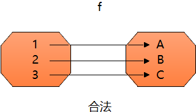
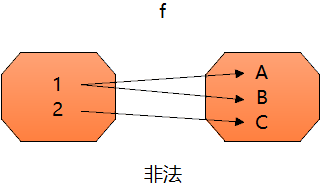
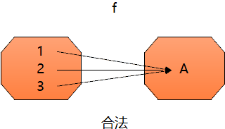

# Think in FP

## 00: Functional Programming 简述

### Functional Programming 堀起

Functional Programming (FP) 从 Lisp 开始已经有近60年的历史了, 但直到近10几年才越来越受到重视, 不但新的 Functional Programming Languages (如 Clojure, Elm, Elixir) 不断的出现. 主流语言(如 JavaScript, Python, Swift) 也都具备了支持 FP 的特性, 连 Java, PHP 也都相继加入支持 FP 的语言特性.

FP 的思想不只是影响在编程语言上, 程序架构上也都受到了 FP 的影响, 例如 Google 提出的 MapReduce 用来处理大量数据的并行运行. 如今 FP 的重要性已经不言而喻, 几乎可以说是程序员的必备知识.

### 跨领域语言

如前所述, 目前所有主流语言对于 FP 都有很强的支持, 学习 FP 的概念对于学习不同领域的语言都会有很大的帮助, 尤其是理解 FP 的抽象概念后, 上手相关新语言的成本会大大降低!

### 抽象化思维

FP 的影响不止在写代码上, 更多的是一种思维上的转变.

## 01: Why Functional Programming ?


当我们接手或开发一个无比庞大又极度不稳定的系统时, 最常遇到的麻烦是, 当我们修改了 A 组件(Component)时, 我们已经确认所有使用 A 组件的地方都跟着修改了, 但修改完后仍然造成了 B, C 出错, 当我们去把 B, C 修好后, 可能 D, E 又坏了. 最后不得不重写整个系统.

### 系统难以维护的原因

什么原因导致系统会出现改 A 坏 B, 改 B 又坏 C 呢? 理论上我们修改了 A, 只要根据 A 组件输入输出是否有改动, 去查找对应使用 A 的地方做对应的修改就可以了, 但即使如此为什么还是会出现没被发现的 BUG ?

最有可能的原因就是 A 组件不是 **pure** 的, 它改动了外部的状态, 当你改变了 A 的行为, 可能同时影响到了外部状态的改变, 而 B 又可能依赖于这个外部状态, 导致 B 出错.

用 sample code 来表示的话大概是像下面这样:

```javascript
const state = { xxx: 1 };

function A (x) {
    let s;
    //...
    state.xxx = s;
    //...
    return s;
}

function B (y) {
    let z;
    //...
    z = y + state.xxx;
    //...
    return z;
}
// A 跟 B 并没有直接相关, B 也没有使用到 A, 但修改 A 时, 有可能会造成 B 出错.
```

如果用 FP 的写法, 我们会完全避免这种 Function 的产生, 这会大大降低系统的状态复杂度, 进而减少 BUG.

- Pure: 是指一个 Function 只要传入相同的参数将永远返回相同的结果, 并且不会造成任何副使用(Side Effect), 如修改外部状态.
- FP: FP 虽然不能完全避免 BUG, 但可以减少不必要的复杂度, 让系统更好维护.
- Out of the Tar Pit: 这篇[论文](http://curtclifton.net/papers/MoseleyMarks06a.pdf?fbclid=IwAR0gb8bUhNOewLehDjazJapgwIQAFaG6NEGiL_WWpLqXs1c8KaIKtJAZCiE)在探讨各种编程模式能不能降低系统的复杂度, 其中就有提到 FP 可以很好的避免因状态所导致的复杂性问题.

### Functional Programming 的优势

#### 低复杂度 (Complexity)

如前所述, FP 世界中的 Function 没有状态, 也不会直接存取或修改外部的状态, 只要同一个 Function 输入相同的参数, 就永远会返回相同的结果. 因此代码也会更好维护, 同时开发速度也会更快, 不容易出现莫句其妙的 BUG.

#### 简单 (Simple), 也更容易 (Easy)

FP 的世界里面只要学会 Function, 不用再学习各种设计模式 (pattern), 通过 Function 的组合以及好的命名, 就能让程序更可读也更具有弹性.

| OO pattern/principle (面向对象的设计模式/原则) | FP equivalent (函数式编程的对应等价内容) |
| ---------------------------------------------- | ---------------------------------------- |
| Single Responsibility Principle (单一责任原则) | Functions                                |
| Open/Closed principle (开闭原则)               | Functions                                |
| Dependency Inversion Principle (依赖倒转原则)  | Functions                                |
| Interface Segregation Principle (接口隔离原则) | Functions                                |
| Factory pattern (工厂模式)                     | Functions                                |
| Strategy pattern (策略模式)                    | Functions                                |
| Decorator pattern (装饰器模式)                 | Functions                                |
| Visitor pattern (访问者模式)                   | Functions                                |

简单 (Simplicity) 是可靠 (reliability) 的先决条件, 简单带来的好处是: 容易理解, 容易改变, 容易除错和具有弹性.

#### 代码简洁

FP 使用大量的 Function, 几乎每个 Function 都可以由非常小的 Function 组合出来, 减少代码的重复度, 因此 FP 的写法通常代码较短.

在 2002 年, [Revenge of the Nerds](http://www.paulgraham.com/icad.html) 文中提到 ITA 的总裁说同样的功能下 1 行的 Lisp 可以取代 20 行的 C.

在《人月神话》第八章有提到, 选择合适的高阶程序语言(相较于低阶语言代码行数较少), 有助于提升项目的开发速度, 生产力可以提升五倍. 不过使用 FP 能够提升开发速度的原因并不在于代码行数的减少, 更大的原因是降低了 BUG 产生的可能性, 让除错的时间更少. (在《人月神话》中预估测试与除错要花费整个项目开发时间的一半)

## 02: All You Need Is Function

### Functional Programming 是什么 ?

Functional Programming (FP) 是一种编程范式 (programming paradigm), FP 的核心思想就是通过 function 为解决各种问题, 并且所有的 function 都是以 **数学函数** 为模型. 在 FP 里 function 是有更明确定义的:

functions 是一种表达式, 可以输入参数, 一理输入参数后就可以**被简化(reduced)**或是说**被运算(evaluated)**.

```javascript
add(1)(2) // 可以被简化成 3
```

所有 Pure Functional Programming Languages 都是由表达式(expression) 所组成的, 这跟其他大多数语言不同, 大多数编程语言是由表达式(expression)和语句(statement) 组成的.

### Function

#### 一等公民 (First-Class)

在 Functional Programming 的世界里 function 是一等公民(first-class), 所谓的一等公民指的是 function 和其他数据类型是具有相同地位的, 也就是说 function 可以当作一个 function 的参数, 也可以被当作一个 function 的返回值, 也可以赋值或保存到变量中.

```javascript
function request(onSuccess) { // onSuccess 是一个 function 被当作参数传给 request
    // onSuccess(data)
}

function add(x) {
    return function(y) { // function 被当作 add 的返回值
        return x + y;
    }
}

const hello = () => 'hello world'; // function 作为 value 被赋值给 hello 变量.
```

一种程序语言要支持 FP, 最少要符合 function 是一等公民这个条件, 才有办法用 FP 的手法来写代码.

#### 引用透明 (Referential Transparency)

在 FP 的世界里, function 是引用透明的, 引用透明指的是一个 expression 传入相同的参数, 不管运算几次, 永远会得到相同的返回值, 并且不会对外部世界造成任何改变 (即没有 Side Effect), 也就是说只要有相同的输入, 那输出就一定是可以预测的.

```javascript
const arr = [1, 2, 3];
arr.slice(0, 1); // return [1];
arr.slice(0, 1); // return [1];
// slice 是引用透明的, 不管执行几次, 只要传入的参数相同, 永远都会拿到相同的返回值.

arr.splice(0, 1); // return [1];
arr.splice(0, 1); // return [2];
// splice 不是引用透明的, splice 改变了 arr, 即对外部世界造成了改变.
```

引用透明的 Function 又可称为 Pure Function. 差别只在于纯函数指的是 Function 而引用透明则可以用在各种表达式上. 引用透明也可以理解为, 一个表达式可以直接替换成它的运算结果, 并且不会对整个程序有任何影响.

### 抽象的来看 Function

如果抽象的来看 Function, 其实 function 就是把一群可能的参数(集合)转换成一群输出(集合).

举例来说:
$$
f(1) = A
$$

$$
f(2) = B
$$

$$
f(3) = C
$$



其实就是 `{1, 2, 3}` 的集合通过 function f 转换成了 `{A, B, C}` 的集合, 其中的重点在于传给 function f `1` 的时候, 返回值永远是 `A`.

相对的, 下面这个 function 就不符合 FP 定义的 function.
$$
f(1) = A
$$

$$
f(1) = B
$$

$$
f(2) = C
$$



因为同样的 f function 输入 `1` 但返回值却有时候是 `A` 有时候是 `B`, 这就是不可预测且不合法的 function.

如果是不同的输入相同的输出, 则是合法的, 如下
$$
f(1) = A
$$

$$
f(2) = A
$$

$$
f(3) = A
$$



这里 f 不管传入的是 `1`, `2` 还是 `3` 都会返回 `A`, 这是合法的, 因为我们只需要确保输入相同的参数, 永远会返回相同的值即可.