[参考链接](http://www.yanhuangxueyuan.com/Three.js_course.html)

# 1. 第一个 three.js 三维场景

## 1.1 第一个3D场景

[代码](1.1.html)

- 几何体 Geometry : `THREE.BoxGeometry(100, 100, 100)` 创建了一个长宽高都是100的立方体.
- 材质 Material : `THREE.MeshLambertMaterial` 用于创建一个可以用于立方体的材质对象, 可以包含颜色, 透明度等属性.
- 光照 Light : `THREE.PointLight` 用于创建一个点光源对象.参数表示RGB对应的光照强度.
- 相机 Camera : `THREE.ORthographicCamera` 创建一个正射投影相机对象.

### 程序结构树状图

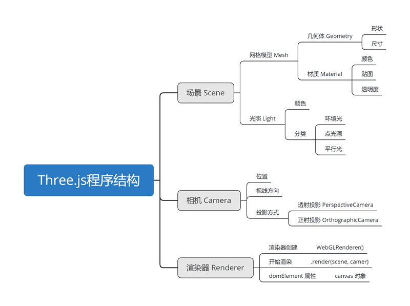

### 场景 - 相机 - 渲染器

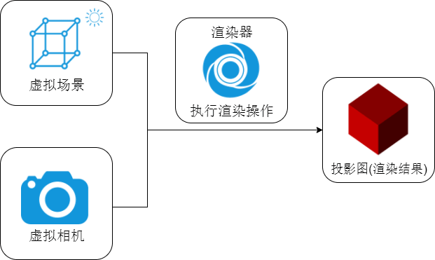

### 对象, 方法和属性

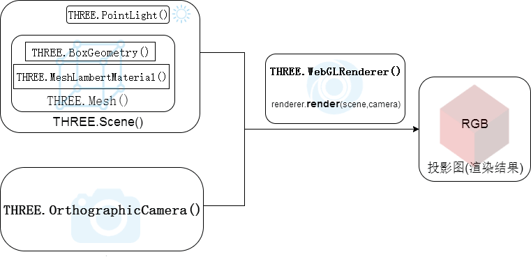

### WebGL 封装

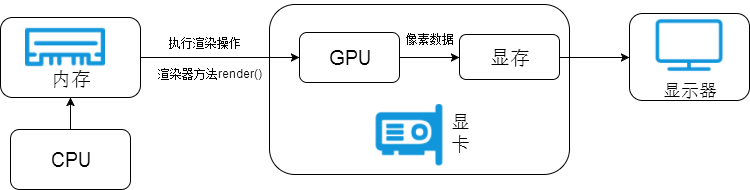

## 1.2 插入新的几何体

[代码](1.2.html)

- SphereGeometry(radius, widthSegments, heightSegments) : 创建一个球体

  | 参数           | 含义     |
  | -------------- | -------- |
  | radius         | 球体半径 |
  | widthSegments  | 球面精度 |
  | heightSegments | 球面精度 |

## 1.3 设置透明度和高光

[代码](1.3.html)

### 设置透明度

更改材质对象参数中的 opacity 和 transparent 属性实现透明度.

opacity : 表示透明, 值的范围是0~1.

transparent : 表示是否开启透明度效果, 默认是 false 表示透明度设置不起作用.

### 添加高光

MeshLambertMaterial() 实现的是漫反射渲染, 高光效果要通过 MeshPhongMaterial() 模拟镜面反射实现. 

specular : 表示高光颜色, 高光颜色的 RGB 值会与光照颜色的 RGB 分量相乘. 

shininess : 可以理解为光照强度的系数.

## 1.4 添加旋转动画

[代码](1.4.html)

## 1.5 鼠标操作三维场景

[代码](1.5.html)

- THREE.OrbitControls(camera, renderer.domElement) : 创建操作控件, 注意第二个参数.
- controls.addEventListener('change', render) : 监听到 change 事件后触发渲染, 但一般都会有 requestAnimationFrame 循环调用, 所以一般不用特意注册事件.

# 2. 点、线、面

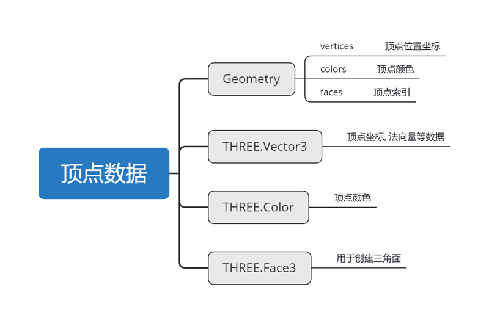

[代码](2.html)

## 2.1 颜色插值

[代码](2.1.html)

## 2.2 几何体三种渲染方式

- THREE.Line : 四个点可以连续绘制出3条直线.
- THREE.LineLoop : 与 Line 模式基本一致, 最后会产生闭合.
- THREE.LineSegments : 两个点确定1条直线, 四个点确定2条直线.

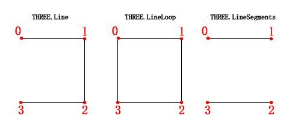

- 立方体构造函数后三个参数为立方体的细分度, 默认都是1.

# 3. 几何体对象 (三维建模)

## 3.1 常见三维几何体构造函数

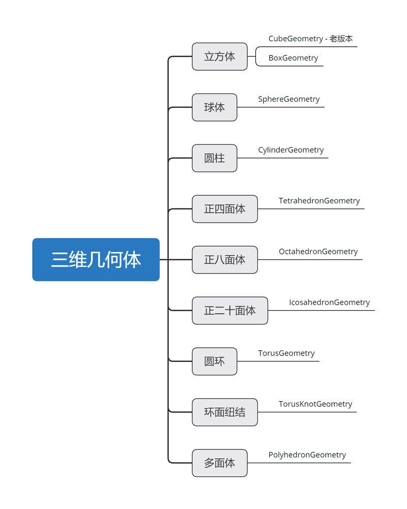

## 3.2 多面体 PolyhedronGeometry

[代码](3.2.html)

## 3.3 平面构造函数

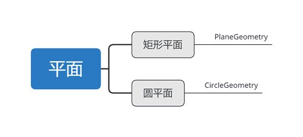

[代码](3.3.html)

- 矩形平面 PlaneGeometry(width, height, widthSegments, heightSegments) : 

  | 参数           | 含义                  |
  | -------------- | --------------------- |
  | width          | 宽                    |
  | height         | 高                    |
  | widthSegments  | 宽的细分数, 默认值为1 |
  | heightSegments | 高的细分数, 默认值为1 |

  从 WebGL 角度看三个顶点确定一个三角面, 一个矩形面至少需要两个三角面组成, 换句话说细分数就是1, 细分数越大, 就有越多的三角面组成一个矩形面, 本质上也就是顶点数量的增加.

- 圆平面 CircleGeometry(radius, segments, thetaStart, thetaLength) : 

  | 参数        | 含义                  |
  | ----------- | --------------------- |
  | radius      | 圆弧半径              |
  | segments    | 圆的细分数量          |
  | thetaStart  | 起始角度, 默认值是 0  |
  | thetaLength | 结束角度, 默认值是 2π |

## 3.4 二维轮廓线

[代码](3.4.html)

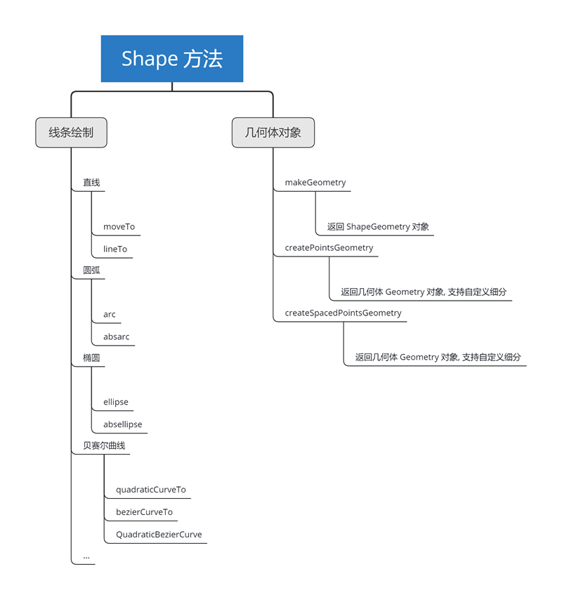

Shape 对象创建的轮廓线要想渲染出来, 首先要转化为几何体对象 Geometry, Shape 对象本身并不是顶点数据, 可以理解为是一种绘图方法, 就像数学中的曲线函数. Shape 对象转化为几何体, 本质上就是利用 Shape 定义的曲线函数生成顶点数据供 GPU 使用.

## 3.5 拉伸与扫描成型

`ExtrudeGeometry()` 和 `ShapeGeometry()` 一样是利用 Shape 对象生成几何体对象, 区别在于 `ExtrudeGeometry()` 是利用2D轮廓生成3D模型. 

`ExtrudeGeometry()` 第二个参数是拉伸参数, 数据类型是 Object.

| 属性                             | 含义                                  |
| -------------------------------- | ------------------------------------- |
| ~~amount~~(老版本) depth(新版本) | 拉伸长度, 默认100                     |
| bevelEnabled                     | 是否使用倒角                          |
| bevelSegments                    | 倒角细分数, 默认3                     |
| bevelThickness                   | 倒角尺寸 (经向)                       |
| curveSegments                    | 拉伸轮廓细分数                        |
| steps                            | 拉伸方向细分数                        |
| extrudePath                      | 扫描路径 THREE.CurvePath, 默认Z轴方向 |
| material                         | 前后面材质索引号                      |
| extrudeMaterial                  | 拉伸面, 倒角面材质索引号              |
| bevelSize                        | 倒角尺寸(拉伸方向)                    |

[代码](3.5.html)
扫描:
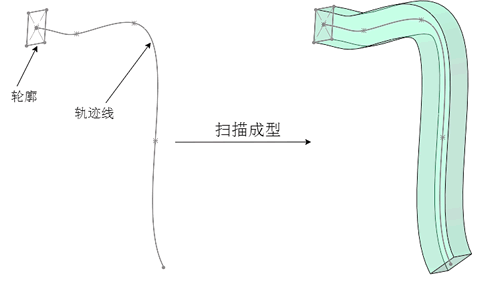

## 3.6 3D样条曲线生成管道

实际生活中的圆形截面电线, 软管等呈现样条状的几何体, 可以通过管道构造函数 `TubeGeometry()` 生成. 它和 ExtrudeGeometry() 一样是利用已有的 2D 或 3D 线条生成相关顶点数据的.

[代码](3.6.html)

- TubeGeometry(path, tubularSegments, radius, radiusSegments, closed) :

  | 参数            | 值                      |
  | --------------- | ----------------------- |
  | path            | 扫描路径                |
  | tubularSegments | 路径方向细分数, 默认64  |
  | radius          | 管道半径, 默认1         |
  | radiusSegments  | 管道圆弧细分数, 默认8   |
  | closed          | Boolean值, 管道是否闭合 |

## 3.7 参数化曲面

参数化曲面简单的说就是数学函数插值计算后生成一个曲面的顶点数据, 这需要借助构造函数 ParametricGeometry() 实现, 立方体、球体等规则几何体都是该构造函数的进一步封装.

[代码](3.7.html)

## 3.8 旋转造型

[代码](3.8.html)

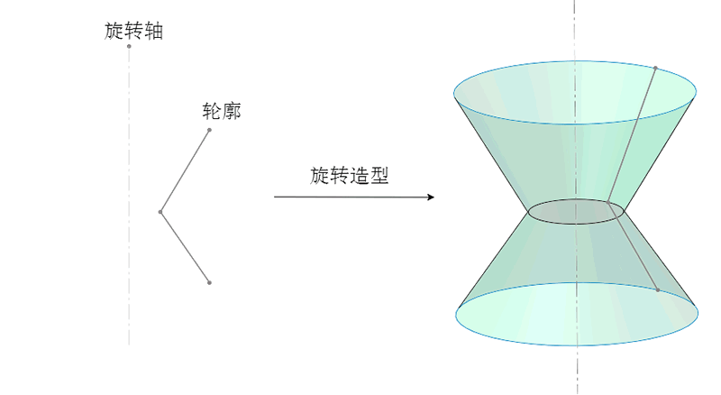

# 4. ThreeBSP 布尔运算

three.js 本身并没有提供用于几何布尔运算的构造函数, 需要借助一个库 ThreeBSP.js 实现.

几何体的布尔运算可以借助数学中学习的差集, 并集, 交集概念去理解. 几何体之间的运算本质上就是两个顶点集合的运算.

两个几何体位置关系

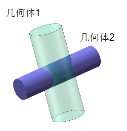

差集 (相减)

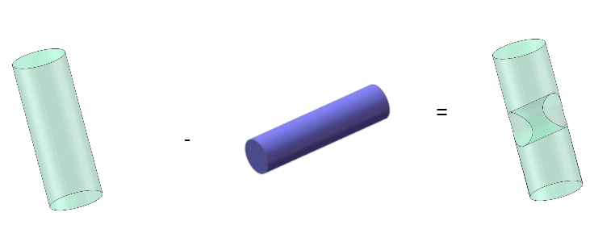

并集 (组合, 相加)

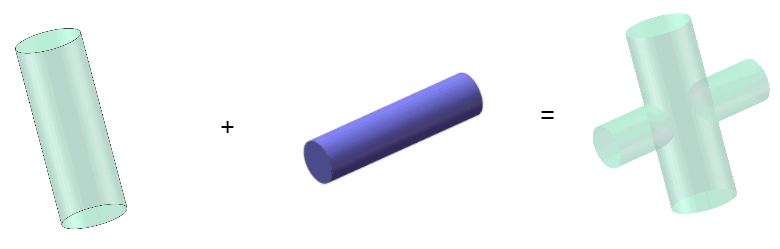

交集 (两个几何体重合的部分)

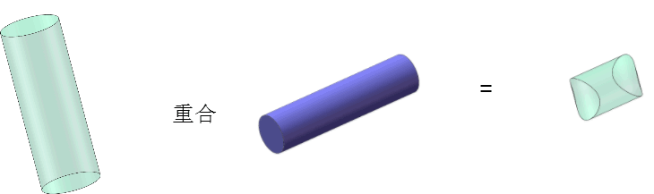

[代码](4.html)

网格 Mesh 模型对象作为构造函数 `ThreeBSP()` 的参数, 可以把普通的 Mesh 模型包装为 ThreeBSP 对象, 表示对应 Mesh 对象的 ThreeBSP 对象可以进行布尔运算, 计算结果在执行 toMesh() 方法可以把 ThreeBSP 对象重新转化为 Mesh 对象.

布尔计算方法

| 方法      | 作用             |
| --------- | ---------------- |
| intersect | 交集, 重合的部分 |
| union     | 并集, 组合, 相加 |
| subtract  | 差集, 相减       |

# 5. 几何变换

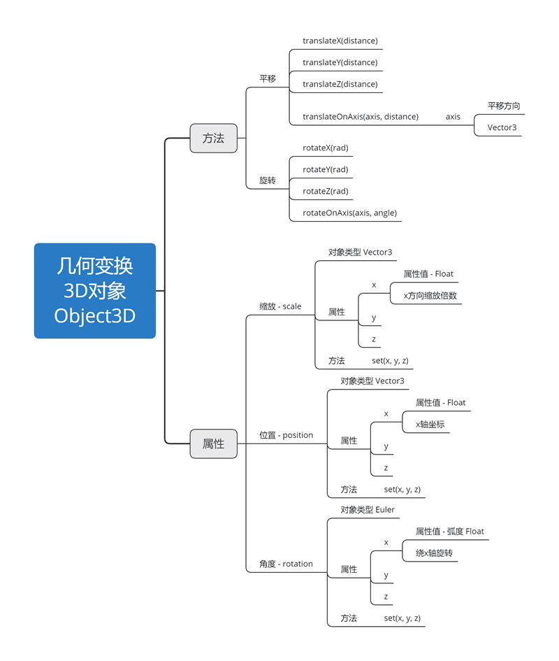

[代码](5.html)

## 5.1 position 和 translateX()

位置属性 `position` 和平移方法 `translateX()` 一样都是设置距离, 方法 `translateX()` 设置的是相对上一次位置进行平移, 两次执行该方法, 距离会叠加. `position` 属性设置的距离是相对坐标系原点位置, 两次执行 `position` 属性, 只会更新定位, 两次的距离参数不是叠加关系, 而是替换关系.

## 5.2 rotation 和 rotateX()

`rotation` 属性和旋转方法 `rotateX()` 差异和 `position` 属性与平移方法 `translateX()` 的差异类似. 一个是相对坐标系设置角度, 位置. 一个是相对当前的三维模型的状态设置角度, 位置参数. 旋转和平移参考的都是坐标系, 不过参考的坐标系稍有不同. 平移参考的是世界坐标系或者说三维场景对象 `Scene` 的坐标系. 三维模型的旋转参考的是模型坐标系, 也就是对三维模型本身建立的坐标系.

## 5.3 坐标系

- 场景中的立方体, 圆柱等三维模型的位置属性, 平移方法参照 Scene 对象的世界坐标系.
- 场景中的立方体, 圆柱等三维模型的角度属性, 旋转方法参照模型自身的模型坐标系.

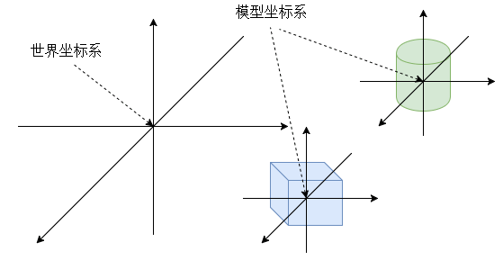

## 5.4 一个几何体 - 多个网格模型

可以通过一个几何体创建多个网格模型, 网格模型可以共享几何体对象和材质对象. 针对网格模型对象进行缩放平移旋转变换, 并不会影响其他网格模型.

几何体对象也可以进行缩放平移旋转变换, 一旦修改, 通过几何体对象创建的网格模型都会受影响.

[代码](5-1.html)

# 6. 三维模型复制、克隆

[代码](6.html)

# 7. 三维模型阵列

three.js 并没有提供几何体或网格模型阵列的API, 不过可以通过 for 循环自定义.

[代码](7.html)

## 7.1 整体平移立方体

创建好一批立方体网格模型后, 如果希望整体进行平移操作, 不需要一个个执行平移操作, 可以利用 Object3D 对象对网格模型进行分组, 对这个组 Object3D 进行平移操作即可. Object3D 对象支持嵌套.

# 8. 材质

# 9. 纹理贴图

[代码](9.html)

## 9.1 不同几何体默认的映射方式

- 球体几何体映射

  

- 立方体映射

  

- 圆柱映射

  圆柱映射默认的是圆柱面、两个底面分别对应一张纹理贴图.

## 9.2 立方体添加局部贴图

[代码](9.2.html)

创建一个 PlaneGeometry 作为局部纹理贴图

## 9.3 纹理映射 (WebGL)

[代码](9.3.html)

## 9.4 一个几何体的多个面分别对应一个纹理贴图

[代码](9.4.html)

- ~~MeshFaceMaterial~~ : 已弃用, 直接传递一个包含多个材质的数组即可.(需要注意指定不同的渲染面)

# 10. 光照模型

## 10.1 光源对象分类

[代码](10.html)

- 点光源 PointLight : 点光源就像生活中的白炽灯, 光线沿着发光核心向外发散, 同一平面的不同位置与光线入射角是不同的.

  `PointLight(color, intensity, distance, decay)`

  参数 intensity 表示光照强度系数, 默认情况下是1, 比如 `PointLight(0x080808, 0.5)` 等价于 `PointLight(0x040404)`.

  参数 distance 表示用来设置光源光线随着距离变化衰减的程度, 一般在机械或工业设计的渲染中用不到, 一般在为了表达点光源在雾中的衰减效果时才会用到.

- 环境光光源 AmbientLight : 光线在自然环境物体之间会来回反射, 宏观来看形成一个没有特定方向的光场环境. 实际生活的环境光的 RGB 三种成分通常是一样的, 也就是说颜色值是黑色, 白色或介于黑白之间的灰色. 特殊场合下, 比如舞台上往往会营造出各种彩色效果.

- 平行光源 DirectionalLight : 相比点光源少了 distance 和 decay 两个参数.

# 11. 相机对象

针对不同应用的三维场景需要使用不同的投影方式, 比如机械, 工业设计领域常常采用正投影 (平行投影), 游戏场景往往采用透视投影 (中心投影).

## 11.1 正投影与透视投影

[代码](11.1.html)

对于正投影而言, 一条直线放置的角度不同, 投影在投影面上的长短不同. 对于透视投影而言, 投影的结果除了与几何体的角度有关, 还和距离有关.

- 正投影相机对象 OrthographicCamera :

  

  | 参数   | 含义                                                         | 默认值 |
  | ------ | ------------------------------------------------------------ | ------ |
  | left   | 渲染空间的左边界                                             |        |
  | right  | 渲染空间的右边界                                             |        |
  | top    | 渲染空间的上边界                                             |        |
  | bottom | 渲染空间的下边界                                             |        |
  | near   | 表示从距离相机多远的位置开始渲染, 一般情况会设置一个很小的值. | 0.1    |
  | far    | 表示的是距离相机多远的位置截止渲染, 如果设置的值偏小, 会有部分场景看不到. | 1000   |

  注意: 左右边界的距离与上下边界的距离比值要与画布的渲染窗口的宽高比例一致, 否则三维模型的显示效果会被单方向不等比例拉伸.

- 透视投影相机对象 PerspectiveCamera :

  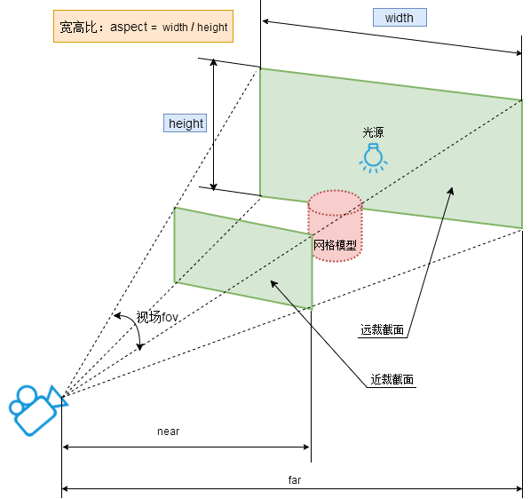

  | 参数   | 含义                                                         | 默认值                                 |
  | ------ | ------------------------------------------------------------ | -------------------------------------- |
  | fov    | 视场, 就是能够看到的角度范围, 人的眼睛大约能够看到180度的视场, 视角大小设置要根据具体应用, 一般游戏会设置60~90度. | 45                                     |
  | aspect | 表示渲染窗口的长宽比, 如果一个网页上只有一个全屏的 canvas 画布且画布上只有一个窗口, 那么 aspect 的值就是网页窗口区的宽高比. | window.innerWidth / window.innerHeight |
  | near   | 表示的是从距离相机多远的位置开始渲染, 一般情况会设置一个很小的值. | 0.1                                    |
  | far    | 表示的是距离相机多远的位置截止渲染, 如果设置的值偏小, 会有部分场景看不到. | 1000                                   |

如果是观察一个产品外观效果, 相机就位于几何体的外面, 如果是室内漫游预览, 就把相机放在房间三维模型的内部.

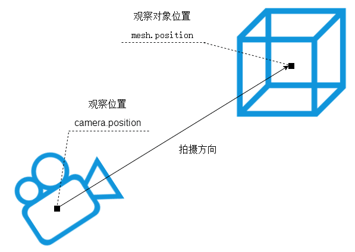

## 11.2 第一人称相机控件

[代码](11.2.html)

| 操作                   | 功能               |
| ---------------------- | ------------------ |
| 鼠标移动               | 调整视角           |
| 上、下、左、右、方向键 | 前、后、左、右移动 |
| W、S、A、D键           | 前、后、左、右移动 |
| R、F键                 | 上、下移动         |
| Q键                    | 停止               |

# 12. 三维模型

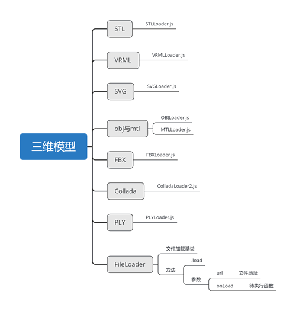

## 12.1 STL格式

基本所有的三维软件都支持导出 .stl 格式的三维模型, stl 三维模型不包含材质信息, 可以简单地把 stl 文件理解为几何体对象 Geometry.

[代码](12.1.html)

## 12.2 OBJ格式

使用三维软件导出 .obj 模型文件的时候 , 会同时导出一个材质文件 .mtl, obj 和 stl 文件包含的数据一样都是几何体对象的顶点位置, 顶点法向量等顶点相关数据, 材质文件 mtl 包含的是 RGB 颜色值等材质信息

[代码](12.2.html)

# 13. 世界坐标转化为屏幕坐标

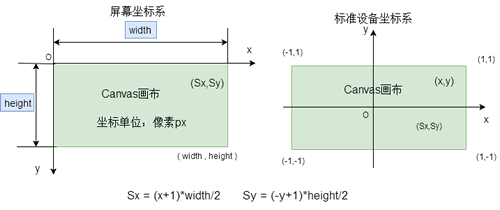

Vector3 对象的方法 project, 方法的参数是相机对象.

`worldVector.project(camera);` 返回的结果是世界坐标 worldVector 在 camera 相机对象矩阵变化下对应的标准设备坐标, 标准设备坐标 xyz 的范围是 [-1, 1].

[代码](13.html)

# 14. 选择三维模型对象 (射线拾取)

如果要实现在 canvas 画布上使用鼠标单击选中一个三维模型对象, 首先要把鼠标单击位置的屏幕坐标转化为标准设备坐标, 然后借助 Vector3 对象 的 unproject 方法把标准设备坐标转化为世界坐标. 然后用这个世界坐标和相机对象的世界坐标作为参数创建一个射线对象 Ravcaster.

[代码](14.html)

# 15. 可视化操作三维模型

[代码](15.html)