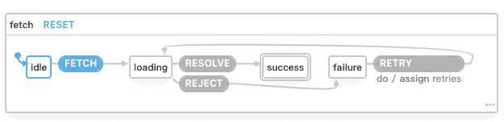

# XState

## 01: XState 简介

### XState 是什么?

XState 是一个状态管理(State Management)的 Library, 负责储存及描述各种状态与各种状态间的转换, 有点类似于 Redux, Flux等, 不同的地方在于 XState 整个核心都源自于 Statecharts, 也就是我们需要定义好整个应用程序会有哪些状态, 和每个状态下能转换到哪些状态以及他们之间是如何转换的.

### Statecharts 是什么?

其实 Statecharts(状态图)并不是什么新技术或新概念, 早在 1984 年 David HAREL 的[论文](https://www.inf.ed.ac.uk/teaching/courses/seoc/2005_2006/resources/statecharts.pdf)就提出了 Statecharts, 是由早期的状态图(state diagrams)所拓展而来的, 在该篇论文中对状态图加入了三个元素分别处理了层级(hierarchy), 并发(concurrency)和通讯(communication). 让原先的状态图变的高度结构化且能更有效地描述各种状态.

用 Statecharts 来描述 Fetch 就会如下面这张图:



### 为什么需要 XState?

其实用过 Angular.js 的开发者都会知道状态管理的重要性, 当应用程序的状态分散在不同的地方时, 就会使得状态难以管理, 并且容易出现 Bug, 直到 Flux 出现并提出了单一数据源(Single Source of Truth)及单向数据流(unidirectional data flow)等概念后, 状态管理的问题才得到缓解. 而 Redux 的出现利用 FP 的手法大幅度的降低原先 Flux 的复杂度以及学习成本, 如果我们依照 Redux 的架构已经可以把**因为状态复杂度而陡然上升的维护成本**控制得很好, 那如今为什么我们还需要一个新的状态管理工具呢?

#### 缺乏清晰的状态描述

不管是使用 Redux 或其他相关的 Library 都会有**状态难以清晰描述**的问题, 最主要原因有两个, 第一个是我们完全混合了状态(state)和资料(context), 所以东西都直接往 Reducer 里面塞导致我们无法分清楚哪些是资料, 哪些是状态.

> 这里的资料(context)指的是显示在页面上的内容, 通常这些资料会存储在后端并通过 API 取得, 在 XState 中称之为 context, 在 UML State Mechine 里面称为 Extended states; 而状态(state)则是指应用程序当前的状态, 比如说是否已经登录或者菜单是否展开等等状态.

另一个原因是我们通常都使用 flag 来表达某个小状态, 再由多个 flags 来表达某种状态, 当这种 flag 越来越多时, 我们的程序就容易出现 Bug, 比如:

```javascript
if(isLogin && isYYY && isXXX)
// 这样的代码其实就是所谓的 bottom-up code, 通常是先有一个小状态比如说 isLogin 然后, 后面又加了其他各种状态, 当这种小状态一多, 就会让程序出现难以察觉的 Bug.
```

> bottom-up code 有哪些坏处可以参考 [David Khourshid 2018年在 FEDC 的演讲](https://www.youtube.com/watch?v=ZENUkQUl1_w&feature=youtu.be&t=819) (约 13:39 - 14:48)
>
> difficult to test 难以测试
>
> difficult to understand 难以理解
>
> will contain bugs 易有 Bugs
>
> difficult to enhance 难以扩展
>
> features make it worse 功能混乱

> David Khourshid 是 XState 的作者.

#### 过于自由的状态转换

如上所述, 过去我们的状态是由多个 flags 所组成, 这导致了我们无法**明确的**定义各种状态之间的关系, 最后就会变成我们无法确定状态之间的切换是否正确, 比如说 `isAdmin` 为 `true` 时 `isLogin` 应该必须为 `true`. 像这样用 flag 储存小状态就有可能出现状态转换出错的情况, 比如说 `isAdmin` 设置为 `true` 了, 却忘记把 `isLogin` 也设置为 `true`; 而实际上状态的复杂度会比这里举的例子复杂许多, 这样的代码大到一定程度时就会变成我们再也无法真正理解程序有哪些状态, 以及哪些可能的状态应该被处理 (除非你再从头跟 PM 及 Designer 完整的过一次流程, 但如果项目够大很有可能他们也不会很清楚).

#### 难以与程序员之外的人讨论

同样的当我们今天用各种 flags 的方式去描述整个应用程序的状态时, 其实是很难跟程序员之外的人沟通或讨论的, 就算是程序员也要追 Code 花时间理解当前的程序到底是如何运行并且在哪个状态下出现的 Bug, 这会让我们很难快速地发现问题也很难跟 PM 讨论需求设计是否存在逻辑上的矛盾, 或是有未处理的状态.

### XState 有什么优势?

#### 程序代码即 UI

用 XState 定义好各种状态后, 就可以直接利用 XState 提供的[图像化工具(Visualizer)](https://xstate.js.org/viz/)把代码转换成图片. 通过图片展示可以很方便的与 PM 及设计师讨论哪方面流程有问题, 或是还有哪些没有明确的状态.

#### 写更少的测试

由于我们已经明确定义了各种状态以及每个状态之间的关系, 这让我们可以更轻松的编写测试, 也不需要测试那些根本不可能出现的状态, 并通过 [Model-based Testing](https://en.wikipedia.org/wiki/Model-based_testing) 我们只需要写各个状态下的断言(assertion)就可以自动把各种状态切换的路径都测试完!

> XState 在这方面也提供了 [xstate-test](https://github.com/davidkpiano/xstate/tree/master/packages/xstate-test).

#### 更快速的路径优化

当我们完成一个应用程序时, 最需要做的通常就是[用户体验(User Experience)](https://en.wikipedia.org/wiki/User_experience)的优化, 

我们常常需要利用各种服务来收集各个页面间的转化率或是哪些状态能让用户最快路过等等的数据. 通过这些数据来优化我们程序的流程, 让用户体验进一步的提升. 而如果使用了 XState 我们就可以在各个状态转换之间发送 log 到数据收集服务, 进一步分析哪些状态可能是不必要的, 来优化 User Flow.

XState 在这方面也有了 [xstate-analytics](https://github.com/davidkpiano/xstate/tree/master/packages/xstate-analytics), 目前尚不稳定.

> David Khourshid 在 2019 的 ReactiveConf 上分享了如何利用 XState 分析程序的 User Flow 并搭配深度强化学习(Deep Reinforcement Learning)做路径优化! [视频地址](https://www.youtube.com/watch?v=na1-RumWtxE&fbclid=IwAR15N3cd_0PYZo6ilTfQHuA9uO1EclHEniHcpabZ2J6-h-YqOvzM6TnV51A)

## 02: Finite State Machine

如果要上手 XState, 那一定要先知道什么是有限状态机(Finite State Machine).

有限状态机(Finite State Machine, FSM)是一种数学模型, 用来描述系统的行为, 这个系统在**任何时间点**上都只会存在**一个状态**. 举例来说, 红绿灯就会有`红灯`, `绿灯`, `黄灯`三种状态, 在任何时间点上一定是这三种状态中的一种, 不可能在一个时间点上存在两种或以上的状态.

一个正式的有限状态机包含五个部分:

1. 有限数量的状态 (state)
2. 有限数量的事件 (event)
3. 一个初始状态 (initial state)
4. 一个转换函数 (transition function), 传入当前的状态及事件时会返回下一个状态
5. 具有 0 至 n 个最终状态 (final state)

需要强调的是这里的状态(state)指的是系统定性的 mode 或 status, 并不是指系统内所有的资料. 举例来说, 水有4种状态(state) - 固态, 液态, 气态和分子态, 这就属于状态, 但水的温度是可变的且有无限可能性就不属于状态.

红绿灯的例子: [代码](02.js)

首先需要确定 Machine 会有哪些状态, `states` 中的每个 key 就是这个 Machine 拥有的状态, 在这里有 `red`, `green`, `yellow` 三种状态.

```javascript
const lightMachine = Machine({
  states: { // 表示Machine拥有red, green, yellow 三种状态
    red: {},
    green: {},
    yellow: {},
  },
});
```

接下来定义**初始状态**, 如果希望一开始是红灯, 那就给 `initial` 设置 `red`.

```javascript
const lightMachine = Machine({
  initial: "red", // 初始状态
  states: {
    red: {},
    green: {},
    yellow: {},
  },
});
```

再接下来要定义每个状态下会有什么事件, 遇到这些事件时, 会转换成什么状态. 我们给三种状态都设置会有 CLICK 事件, 并且状态的转换是 `red -> green -> yellow -> red...` :

```javascript
//...
red: {
    on: { // on 的 key 代表事件名称, value 则代表转移的下一个状态
    	CLICK: "green",
    },
},
//...
```

然后就可以通过 `lightMachine` 来使用了, 通过 `.transition(state, event)` 这个方法来取得下一个状态.

```javascript
const state0 = lightMachine.initialState;
console.log(state0);
const state1 = lightMachine.transition(state0, "CLICK");
console.log(state1);
const state2 = lightMachine.transition(state1, "CLICK");
console.log(state2);
const state3 = lightMachine.transition(state2, "CLICK");
console.log(state3);
```

返回的 state object 的常用方法及属性是:

- value: 获取当前的状态
- matches(parentStateValue): 判断现在是否是某个状态

lightMachine 每次都要输入当前的 state 跟 event 才能状态转换, 这是为了让 transition 保持是一个 Pure Function. 如果不想要自己储存及管理状态, XState 也提供了 Interpret.

### Interpret

XState 提供了一个叫 `interpret` 的方法可以将一个 machine 对象转换成一个具有状态的 service.

```javascript
const service = interpret(lightMachine);
// 启动 service
service.start();

console.log(service);
service.send("CLICK"); // 发送事件
console.log(service);

// 停止 service
service.stop();
```

> XState 4.7 之后, 一个 service start 后, 其实是一个 subscribable 对象, 可以搭配 Observable 相关的 library 互相操作, 比如可以通过 rxjs 的 from 把 start 后的 service 转换为 rxjs 的 observable.

## 03: Context & Actions

### Context

之前介绍了一个 Machine 的**状态(state)**是有限的, 例如水的状态有(固, 液, 气, 分子), 但我们仍然需要储存非定性的可变**数据(data)**, 这些数据我们会储存在 context 中.

```javascript
const machine = Machine({
  initial: 'red',
  states: {
    //...
  },
  context: {
    count: 0,
    user: null,
  },
});
// 在任何状态下都可以拿到context值
console.log(machine.initialState.context);
```

可以通过 `withContext()` 动态的设置初始数据

```javascript
const service = interpret(
  machine.withContext({
    count: 10,
    test: 1,
    user: {
      name: "Jerry",
    },
  })
);
service.start();
console.log(service.state.context);
```

至于要如何在特定的状态中改变 machine 内的 context 呢? 需要使用 Assign Actions. Actions 是一种 **射后不理(Fire-and-forget) 的 Effect**, 专门用来处理单一的副作用.

### Effects

在 Statecharts 的世界里, Side Effect 可以根据行为分为两类:

- Fire-and-forge effects: 指执行 Side Effect 后不会另外发送任何 event 回 statechart 的 effect.
- Invoked effects: 指除了可以执行 Side Effect 之外还能发送和接收 events 的 effect.

这两类 Effect 在 XState 中根据不同的使用方式, 又可以分为:

- Fire-and-forge effects
  - Actions: 用于单次, 离散的 Effect
  - Activities: 用于连续的 Effect
- Invoked effects
  - Invoked Promises
  - Invoked Callbacks
  - Invoked Observables
  - Invoked Machines

### Actions

Action 本身就是一个 function, 接收三个参数分别是 context, event 以及 actionMeta, context 就是当前 machine 的 context, event 则是触发当前状态切换的事件, actionMeta 则会存放当前的 state 以及 action 对象.

```javascript
const lightMachine = Machine({
  //...
  states: {
    red: {
      // 进入 state
      entry: (context, event) => console.log("entry red"),
      // 离开 state
      exit: (context, event) => console.log("exit red"),
      on: {
        CLICK: {
          target: "green",
          // transition actions 状态间切换时触发 actions
          actions: (context, event) =>
            console.log("hello green", context, event),
        },
      },
    },
    //...
  },
});
```

可以将 actions 定义到 machine options中, 通过 string 指定执行的 action. 也可以指定一个 array 依序执行多个 actions.

```javascript
const lightMachine = Machine(
  {
    //...
    states: {
      //...
      green: {
        entry: ["entryGreen", "temp"],
        exit: "exitGreen",
        on: {
          CLICK: {
            target: "red",
            actions: "greenClick",
          },
        },
      },
    },
  },
  {
    actions: {
      greenClick: (context, event) => console.log("hello red"),
      entryGreen: (context, event) => console.log("entry green"),
      exitGreen: (context, event) => console.log("exit green"),
      temp: () => console.log("temp"),
    },
  }
);
```

### Assign Action

assign 是一个 function 专用用来更新 machine context, 它接收一个 assigner 参数, 这个参数会表示 context 要更新成什么值.

[代码](03.html)

注意事项:

- 永远不要从外部修改一个 machine 内的 context, 任何改变 context 的行为都应该来自 event.
- 推荐使用 assign({...}) 的写法.
- 和 actions 一样不建议 inline 写在 machine 里面, 建议定义在 machine options 的 actions 内.
- 理想情况下, context 应该是一个 JS 的 plain object, 并且应该可以被序列化.
- assign 只是一个 pure function, 返回的对象会对 machine 造成影响.