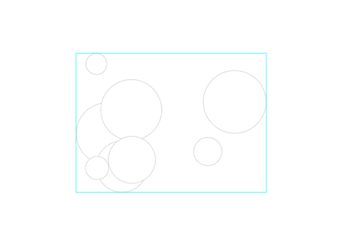
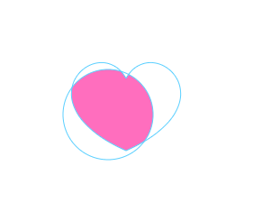
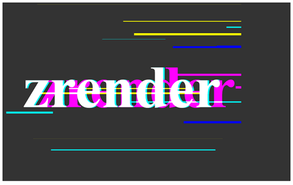
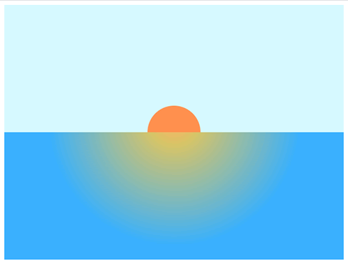
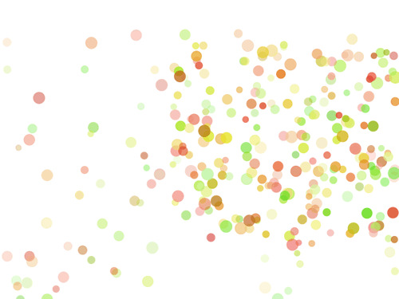

# Animation

ZRender 的基本动画

[参考](https://ecomfe.github.io/zrender-doc/public/examples/animation.html)

- zrender.init : 初始化, 可以通过第二个参数设置 renderer 属于来选择使用 'canvas' 或 'svg'.

# Bounding Box

[参考](https://ecomfe.github.io/zrender-doc/public/examples/bounding_box.html)

- .on(eventName, fn) : 对 ZRender 实例可以监听鼠标事件, 如 mousedown, mouseup, mousemove. 也可以对创建的具体图形 Circle, Rect 等监听.
- zrender.Group : 组.
- getBoundingRect : 可以获取整个图形的范围矩形.

# ClipPath

[参考](https://ecomfe.github.io/zrender-doc/public/examples/clip_path.html)

- setClipPath : 给图形增加路径.

# Glitched Text

[参考](https://ecomfe.github.io/zrender-doc/public/examples/glitched_text.html)

# Hello World

[参考](https://ecomfe.github.io/zrender-doc/public/examples/hello_world.html)

# Particles

[参考](https://ecomfe.github.io/zrender-doc/public/examples/particles.html)